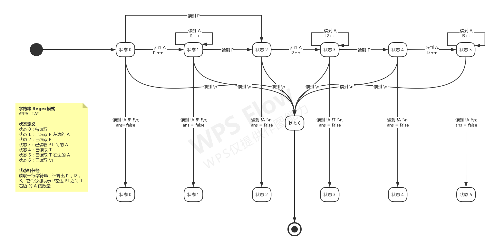

> 注意：文中许多算法设计是根据《算法笔记》[^algo_note] 来写的。

## 排序 Sort

* 冒泡排序 Bubble Sort
  * 思想：每趟中，依次比较两个相邻元素，传递式地在将一个最值传递到端
  * 评价：$O(n^2)$
* 选择排序 Selection Sort
  * 思想：每趟中，找到最值置于一端
  * 评价：$O(n^2)$
* 插入排序 Insertion Sort
  * 思想：原始序列一切为二，有序和无序。每一趟，从无序中取一个插入有序的。类比整理纸牌。
  * 评价：$O(n^2)$
* 归并排序 Merge Sort
  * 思想：二分思想，每次归并两个不相交的部分。
  * 实现：**merge 函数**，合并两个不相交的两部分，拉链式合并到新数组，最后用 memcpy；**merge_sort 函数**，利用辅助函数 merge 递归地或迭代地合并
  * 评价：$O(nlogn)$
* 快速排序 Quick Sort
  * 思想：two pointers，分而治之。按主元分割序列。另外，快排也体现出一种随机选择(Random Selection)的思想。
  * 实现：**partition 函数**，以 two pointers 的方法将序列分割成两个部分，返回主元（prime）下标；**quick_sort 函数**，分而治之地使用 partition 函数
  * 评价：$O(nlogn)$
* 堆排序 Heap Sort
  * 思想：利用堆优先队列的性质
  * 实现：不断取堆顶置于末尾
  * 评价：$O(nlogn)$



```c++
#include <iostream>
#include <algorithm>
#include <cstdlib>  // 用于随机生成待排序的测试数据
#include <cmath>  // 为使用 round
#define MAXN 10005  // 待排序数组的元素大小范围
using namespace std;

// 选择排序：一趟结束，找出最值放在前面，start 和 end 左闭右开
void select_sort(int *start, int *end)
{
    for (int i = 0; start + i < end; i++)  // 从 start + i 到 end 是 待排部分
    {
        int min = i;
        for (int j = i + 1; start + j < end; j++)  // 找到最小值下标
            if (*(start + j) < *(start + min))
                min = j;
        if (start[min] != start[i])  // 当找到的最小值需要交换时
        {
            int tmp = start[min];
            start[min] = start[i];
            start[i] = tmp;
        }
    }
}

// 插入排序：每一趟找到一个合适的值，插入前面，其余值后移，start 和 end 左闭右开
void insertion_sort(int *start, int *end)
{
    for (int i = 0; start + i < end; i++)  // 从 start + i 到 end 是 待排部分
    {
        int tmp = start[i],  // 取待排的首个
        pos = i - 1;  // 找到要插入的位置
        for (; pos >= 0; pos--)
            if (start[pos] > tmp)
                start[pos+1] = start[pos];  // 后移以腾开要插入的位置
            else
                break;  // 找到位置
        start[pos+1] = tmp;  // 插入
    }
}

// 归并排序：二分 + 归并的思想

// merge() 是辅助函数，归并一个数组的任意两个不相交的部分
// 假设其中 l2 = r1 + 1
void merge(int a[], int l1, int r1, int l2, int r2)
{
    int i = l1, j = l2;
    int tmp[MAXN], index = 0;
    while (i <= r1 && j <= r2)
        if (a[i] < a[j]) tmp[index++] = a[i++];
        else tmp[index++] = a[j++];
    while (i <= r1)
        tmp[index++] = a[i++];
    while (j <= r2)
        tmp[index++] = a[j++];
    memcpy(a + l1, tmp, sizeof(int) * index);
}
// 递归实现的归并排序，left 和 right 左闭右闭
void merge_sort_recursion(int a[], int left, int right)
{
    if (left < right)
    {
        int mid = left + (right - left) / 2;
        merge_sort_recursion(a, left, mid);
        merge_sort_recursion(a, mid + 1, right);
        merge(a, left, mid, mid + 1, right);
    }
}
// 迭代实现的归并排序，n 是数组长度
void merge_sort_iteration(int a[], int n)
{
    for (int step = 2; step / 2 <= n; step *= 2)
    {
        for (int l1 = 0; l1 < n; l1 += step)  // 左区间的左端点按照 step 来遍历
        {
            int r1 = l1 + step / 2 - 1;
            if (r1 + 1 < n)  // 当右区间存在元素，则合并
                // 左区间 [l1, r1]，右区间 [r1 + 1, min(l1 + step - 1, n - 1)]
                merge(a, l1, r1, r1 + 1, min(l1 + step - 1, n - 1));
        }
    }
}

// 快速排序：按主元分割数组，分而治之

// 分割是辅助函数，返回最终主元下标，left 和 right 左闭右闭
int partition(int a[], int left, int right)
{
    // 删去前两行，将固定 a[left] 为主元
    int p = round(1.0 * rand() / RAND_MAX * (right - left) + left);
    swap(a[p], a[left]);

    int temp = a[left];
    while (left < right)
    {
        while (left < right && a[right] > temp) right--;
        a[left] = a[right];
        while (left < right && a[left] <= temp) left++;
        a[right] = a[left];
    }
    a[left] = temp;
    return left;
}

// 分割函数的另一种写法
// decreasingly partition the array in [left, right]
int randPartition(int array[], int left, int right)
{
    int p = rand() % (right - left) + left;
    swap(array[p], array[left]);

    int prime = left++;  // 主元为初始的 left 值，left 值 然后向后位移一位
    while (left < right)  // until left == right
    {
        while (left < right && array[left] >= array[prime]) left++;
        while (left < right && array[right] < array[prime]) right--;
        swap(array[left], array[right]);
    }
    swap(array[prime], array[left - 1]);  // 交换主元到中间
    return left;
}

// 快速排序主函数，left 和 right 左闭右闭
void quick_sort(int a[], int left, int right)
{
    if (left < right)
    {
        // pos 为分割点
        int pos = partition(a, left, right);
        quick_sort(a, left, pos - 1);
        quick_sort(a, pos + 1, right);
    }
}

// 测试 ↓

// 根据 seed 生成随机的 n 个随机数
void gen_data(int data[], unsigned seed, int n)
{
    srand(seed);
    for (int i = 0; i < n; i++)
        data[i] = rand() - (RAND_MAX / 2);
}

void output_array(int data[], int n)
{
    for (int i = 0; i < n; i++)
        printf("%d ", data[i]);
    printf("\n");
}

void sort_test()
{
    int data[MAXN];
    // test 1
    {
        int seed = 23, n = 9;
        gen_data(data, seed, n);
        printf("test data: "); output_array(data, n);
        select_sort(data, data + n);
        printf("ss   "); output_array(data, n);
        gen_data(data, seed, n); insertion_sort(data, data + n);
        printf("is   "); output_array(data, n);
        gen_data(data, seed, n); merge_sort_recursion(data, 0, n - 1);
        printf("msr  "); output_array(data, n);
        gen_data(data, seed, n); merge_sort_iteration(data, n);
        printf("msi  "); output_array(data, n);
        gen_data(data, seed, n); quick_sort(data, 0, n - 1);
        printf("qs   "); output_array(data, n);
        printf("\n");
    }
    // test 2
    {
        int seed = 3, n = 15;
        gen_data(data, seed, n);
        printf("test data: "); output_array(data, n);
        select_sort(data, data + n);
        printf("ss   "); output_array(data, n);
        gen_data(data, seed, n); insertion_sort(data, data + n);
        printf("is   "); output_array(data, n);
        gen_data(data, seed, n); merge_sort_recursion(data, 0, n - 1);
        printf("msr  "); output_array(data, n);
        gen_data(data, seed, n); merge_sort_iteration(data, n);
        printf("msi  "); output_array(data, n);
        gen_data(data, seed, n); quick_sort(data, 0, n - 1);
        printf("qs   "); output_array(data, n);
        printf("\n");
    }
    // test 3
    {
        int seed = 1, n = 4;
        gen_data(data, seed, n);
        printf("test data: "); output_array(data, n);
        select_sort(data, data + n);
        printf("ss   "); output_array(data, n);
        gen_data(data, seed, n); insertion_sort(data, data + n);
        printf("is   "); output_array(data, n);
        gen_data(data, seed, n); merge_sort_recursion(data, 0, n - 1);
        printf("msr  "); output_array(data, n);
        gen_data(data, seed, n); merge_sort_iteration(data, n);
        printf("msi  "); output_array(data, n);
        gen_data(data, seed, n); quick_sort(data, 0, n - 1);
        printf("qs   "); output_array(data, n);
        printf("\n");
    }
    // test 4
    {
        int seed = 8967, n = 10;
        gen_data(data, seed, n);
        printf("test data: "); output_array(data, n);
        select_sort(data, data + n);
        printf("ss   "); output_array(data, n);
        gen_data(data, seed, n); insertion_sort(data, data + n);
        printf("is   "); output_array(data, n);
        gen_data(data, seed, n); merge_sort_recursion(data, 0, n - 1);
        printf("msr  "); output_array(data, n);
        gen_data(data, seed, n); merge_sort_iteration(data, n);
        printf("msi  "); output_array(data, n);
        gen_data(data, seed, n); quick_sort(data, 0, n - 1);
        printf("qs   "); output_array(data, n);
        printf("\n");
    }
}

int main()
{
    sort_test();
    return 0;
}
```



## 查找 Search

### 二分查找 Binary Search

* while 循环中是 left <= right or left < right
* 接收参数 left，right 所代表的区间开闭
* 判断时的 array[mid] > or < or >= or <= x
* 不满足情况时的返回值
* 返回值返回什么



```c++
/*
1. `二分查找的本质：查询有序序列第一个满足（或最后一个不满足）给定条件元素的位置`

2. `要注意的关键点：`

   * `while 循环中是 left <= right or left < right`
   * `接收参数 left，right 所代表的区间开闭`
   * `判断时的 array[mid] > or < or >= or <= x`
   * `不满足情况时的返回值`
   * `返回值返回什么`
*/

#include <iostream>
#include <algorithm>

// search x in a[] from left to right (both ends included)
// return -1 if nothing was found
int binarySearch(int x, int a[], int left, int right)
{
    int mid;
    while (left <= right)  // to make mid cover all the possible points
    {
        mid = left + (right - left) / 2;  // using (left + right) / 2 might cause overflow
        if (a[mid] == x)
            return mid;
        else if (a[mid] < x)
            left = mid + 1;
        else
            right = mid -1;
    }
    return -1;
}

void binarySearchTest()
{
    const int n = 10;
    int a[] = {-2, 0, 1, 2, 34, 56, 999, 1990, 11999, 12000};
    printf("Array: {-2, 0, 1, 2, 34, 56, 999, 1990, 11999, 12000}\n");
    printf("Search %d: %d\n", 9, binarySearch(9, a, 0, n - 1));
    printf("Search %d: %d\n", 0, binarySearch(0, a, 0, n - 1));
    printf("Search %d: %d\n", -5, binarySearch(-5, a, 4, n - 1));
    printf("Search %d: %d\n", 100000, binarySearch(100000, a, 0, n - 1));
    printf("Search %d: %d\n", 56, binarySearch(56, a, 0, n - 7));
    printf("Search %d: %d\n", -2, binarySearch(-2, a, 0, n - 1));
    printf("Search %d: %d\n", 12000, binarySearch(12000, a, 0, n - 1));
    printf("Search %d: %d\n", 1990, binarySearch(1990, a, 0, n - 1));
}

// find the first one who is equal to x from left to right (both ends included)
// return -1 if nothing was found
int lowerBound(int x, int a[], int left, int right)
{
    if (left > right) return -1;
    int mid;
    while (left < right)  // 保证结束时 left 和 right 具有相同值
    {
        mid = left + (right - left) / 2;
        if (a[mid] < x)
            left = mid + 1;
        else
            right = mid - 1;
    }
    if (a[left] == x)
        return left;
    else
        return -1;
}

// find the first one who is equal to x from left (included) to right (excluded)
// return original right if no one bigger than x
int upperBound(int x, int a[], int left, int right)
{
    int mid, r = right;
    while (left < right)  // 保证结束时 left 和 right 具有相同值
    {
        mid = left + (right - left) / 2;
        if (a[mid] <= x)
            left = mid + 1;
        else
            right = mid;  // 不满足条件，所以不能 - 1
    }
    if (left >= r)
        return r;
    else
        return left;
}

void lowerBoundUpperBoundTest()
{
    const int n = 10;
    int a[] = {-2, 0, 2, 2, 34, 56, 999, 999, 999, 12000};
    printf("Array: {-2, 0, 2, 2, 34, 56, 999, 999, 999, 12000}\n");
    printf("Search %d: [%d, %d)\n", 9, lowerBound(9, a, 0, n - 1), upperBound(9, a, 0, n));
    printf("Search %d: [%d, %d)\n", 2, lowerBound(2, a, 0, n - 1), upperBound(2, a, 0, n));
    printf("Search %d: [%d, %d)\n", -5, lowerBound(-5, a, 4, n - 1), upperBound(-5, a, 4, n));
    printf("Search %d: [%d, %d)\n", 100000, lowerBound(100000, a, 0, n - 1), upperBound(100000, a, 0, n));
    printf("Search %d: [%d, %d)\n", 56, lowerBound(56, a, 0, n - 7), upperBound(56, a, 0, n - 6));
    printf("Search %d: [%d, %d)\n", -2, lowerBound(-2, a, 0, n - 1), upperBound(-2, a, 0, n));
    printf("Search %d: [%d, %d)\n", 12000, lowerBound(12000, a, 0, n - 1), upperBound(12000, a, 0, n));
    printf("Search %d: [%d, %d)\n", 999, lowerBound(999, a, 0, n - 1), upperBound(999, a, 0, n));
}

// 有序序列第一个满足（最后一个不满足）给定条件元素位置查询问题的模板
int sequentialProblemTemplate(int left, int right)
{
    int mid;
    bool condition; // 条件
    while (left < right)  // 最终 left == right
    {
        mid = left + (right - left) / 2;
        if (condition)  // 条件成立，且待查元素在右
            left = mid + 1;
        else
            right = mid;
    }
    return left;
}

int main()
{
    printf("BEGIN OF binarySearch() TEST\n");
    binarySearchTest();
    printf("END OF binarySearch() TEST\n");

    printf("BEGIN OF lowerBound() & upperBound() TEST\n");
    lowerBoundUpperBoundTest();
    printf("END OF lowerBound() & upperBound() TEST\n");
    return 0;
}
```



### 散列 Hash

散列本质上是查找算法。常用的哈希函数 `hash(key) = key % table_size`，其中 `table_size` 尽量为素数，减少冲突（collision）。其他处理冲突的方法：

* 线性探查法（Linear Probing）：若冲突，则 `hash(key) = (key + 1) % table_size`；
* 平方探查法（Quadratic Probing）：若冲突，则 `hash(key) = (key ± n²) % table_size`；
* 链表法：`hash(key)` 值相同的保存在相同的链表节点上

### 深度优先搜索 Depth First Search

```cpp
// 使用递归实现 DFS 的模板
dfs(some_values_indicating_status)
{
  // 递归边界
  if (boundary_case)
    some_statements;

  // 分岔口
  // 第一种分岔口：取或不取，eg. 元素是否入栈
  // 第二种分岔口：循环，eg. 迷宫的四个方向
  // 两种分岔口都要注意！
  // 是否要在进入下一个 dfs 的前面（后面）缓存（复原）一些在各层 dfs 状态间会相互依赖的变量
}
```

> DFS 例题
>
> 1. **DFS 经典例题**：PAT A1103 “Integer Factorization”，[点此处](https://github.com/Ki-Seki/solutions)，并在以下目录 `solutions/solutions-PAT/A1103.cpp` 中查看题解。
>
> 2. **对存在依赖性变量时的做法**：PAT A1018 “Public Bike Management”，[点此处](https://github.com/Ki-Seki/solutions)，并在以下目录 `solutions/solutions-PAT/A1018.cpp` 中查看题解。
>
> 3. **存在依赖性变量时更灵活的处理**：PAT A1087 “All Roads Lead to Rome”，[点此处](https://github.com/Ki-Seki/solutions)，并在以下目录 `solutions/solutions-PAT/A1087.cpp` 中查看题解。

### 广度优先搜索 Breath First Search

关键点：

* Node 结构体
* 标识数组，如 in_queue，is_visisted，map 变量，set 变量
* bfs
  * 参数：首元素
  * 首元素入队，首元素进行一般性操作
  * 循环：通过首元素找下一层元素

```cpp
// 使用队列 + 循环实现的 BFS 模板

// Node 结构体应该保存一个唯一能标识一个状态的一些变量的组合
// 正确定义 Node 是使用 BFS 的前提
// 访问唯一状态应当用索引，而不是用 Node 本身
struct Node {
  some_attributions;
} all_elements[];

// 记录元素是否已入过队
// 不能改成 is_visited，因为存在未被访问但已在队列中的元素，有可能导致重复入队
// 也可以对原始数据使用染色法，而不单独设置标记数组，如 in_queue 或 is_visited
// 也可以使用 map STL 来标识
bool in_queue[] = {};

void bfs(int s)  // 用 s 作索引，而非 Node 本身
{
  queue<int> q;
  q.push(s);
  while (!q.empty())
  {
    Node front = all_elements[q.front()];
    q.pop();
    for (each in next_layer_of_front)
    {
      q.push(each);
      in_queue[each] = true;
    }
  }
}
```

> BFS 例题
>
> PAT A1091 “Acute Stroke”，[点此处](https://github.com/Ki-Seki/solutions)，并在以下目录 `solutions/solutions-PAT/A1091.cpp` 中查看题解。
>
> CODEUP 100000609-03 “【宽搜入门】魔板”，[点此处](https://github.com/Ki-Seki/solutions)，并在以下目录 `solutions/solutions-CODEUP/100000609-03.cpp` 中查看题解。

## 数学 Mathematics

### 快速幂 Fast Power

快速幂的核心原理是 $a^{m+n} = a^m + a^n$



```c++
/*
 * hint:
 * 三种快速幂计算 a ^ b % c，假设数据范围如下：
 *      a < 10 ^ 9
 * 0 <= b < 10 ^ 9
 *  1 < c < 10 ^ 9
 *
 * 注意保存中间值的变量一定要定义为 long long 类型的；
 * 如 fpr 中的 tmp，fpi 中的 ans 和 fpib 中的 ans。
 * 如果定义为 int，可能导致意外的变量截断
*/

#include <iostream>
#include <ctime>

typedef long long LL;

LL fastPowerRecursion(LL a, LL b, LL c)
{
    if (a == 0 || c == 1) return 0;  // special judge
    if (b == 0) return 1;  // recursive boundary
    a %= c;  // optimization
    if (b & 1)  // if b is even
        return a * fastPowerRecursion(a, b - 1, c) % c;
    else
    {
        LL tmp = fastPowerRecursion(a, b / 2, c);
        return tmp * tmp % c;
    }
}

LL fastPowerIteration(LL a, LL b, LL c)
{
    if (a == 0 || c == 1) return 0;  // special judge
    a %= c;
    LL ans = 1;
    while (b > 0)
    {
        if (b & 1) ans = ans * a % c;
        a = a * a % c;
        b >>= 1;
    }
    return ans;
}

LL fastPowerIterationBits(LL a, LL b, LL c)
{
    if (a == 0 || c == 1) return 0;  // special judge
    a %= c;
    int len = sizeof(LL) * 8, bit;
    LL ans = 1;
    for (int i = len - 1; i >= 0; i--)  // traversal from high bit to low bit in b
    {
        bit = (b >> i) & 1;
        ans = (ans * ans) * (bit ? a : 1) %c;
    }
    return ans;
}

void test()
{
    LL data_set[300][3] = {
        {55, 100, 450},
        {34, 12, 43},
        {0, 1, 1},
        {1, 0, 1},
        {0, 0, 23},
        {100, 100, 10},
        {5, 7, 99999},
        {-1, 45, 4},
        {99993425, 5345, 456754},
        {987654321, 783589549, 4354359834}  // 正确答案可能是：34099175
    };
    int len = 10;

    for (int i = 0; i < len; i++)
    {
        long begin, end;
        LL fpr, fpi, fpib;
        printf("Test %d:\n(a, b, c) = (%d, %d, %d)\n", i + 1, data_set[i][0], data_set[i][1], data_set[i][2]);
        begin = clock();
        fpr = fastPowerRecursion(data_set[i][0], data_set[i][1], data_set[i][2]);
        end = clock();
        printf("fpr  %lld\t%ldms\n", fpr, (end - begin));

        begin = clock();
        fpi = fastPowerIteration(data_set[i][0], data_set[i][1], data_set[i][2]);
        end = clock();
        printf("fpi  %lld\t%ldms\n", fpi, (end - begin));

        begin = clock();
        fpib = fastPowerIterationBits(data_set[i][0], data_set[i][1], data_set[i][2]);
        end = clock();
        printf("fpib %lld\t%ldms\n", fpib, (end - begin));
        printf("\n");
    }
}

int main()
{
    printf("%d %d %d", fastPowerIteration(2, 499, 100000), fastPowerRecursion(2, 499, 100000), fastPowerIterationBits(2, 499, 100000));
    // test();
    return 0;
}
```



### 最大公约数和最小公倍数 Greatest Common Divisor & Least Common Multiple

更相减损法：直接假设 a > b，则 gcd(a, b) = gcd(b, a%b)



```c++
#include <iostream>

using namespace std;

// 最大公倍数的核心要点是:
// 1. a, b, a%b 三个数的公约数相同
// 2. a%b < a, a%b < b
// 3. 假设 gcd(a, b) 中 a >= b 会使问题简化
// 4. 即使初始时 a < b, (a, b) -> (b, a%b) 后也会重回标准
int gcd(int a, int b)
{
    return (!b ? a : gcd(b, a%b));
}

int lcm(int a, int b)
{
    return a / gcd(a, b) * b;
}

int main()
{
    cout << lcm(1, 3) << lcm(2, 4) << lcm(3, 1) << lcm(4, 2);
    return 0;
}
```



### 素数 Prime Number

* 平方技术：判断给定数字是否是素数
* 埃氏（Eratosthenes）筛法：求某范围内的所有素数，原理在于素数不是任何非 1 与非本身数字的倍数，因此从 2 开始枚举所有的倍数，枚举 3 所有的倍数...



```c++
/*
 * hint:
 * 素数相关的算法,包括：
 * 使用 sqrt 来优化的素数判断函数
 * 使用平方技巧来优化的素数判断函数
 * 求素数表：埃氏筛法，Eratosthenes 筛法
*/
#include <iostream>
#include <cmath>

/* 平方技巧的证明：
 * 任何一个数可以拆分成两因子相乘，如 a = n * m；
 * 不失一般性，令 n <= m；
 * 则 max(n) = √a
 * 由于只需要判断所有的 n 是否既不是 1 和 a 且是 a 的因子；
 * 所以循环中遍历到 √a 即可
*/

// 使用 sqrt 来优化的素数判断函数
// 需要 <cmath>
bool is_prime(int n)
{
    for (int i = 2; i <= (int) sqrt(n * 1.0); i++)
        if (n % i == 0)
            return false;
    return true;
}

// 使用平方技巧来优化的素数判断函数
// 缺点是若 n 较大，易产生溢出
bool is_prime_vice(int n)
{
    for (int i = 2; i * i <= n; i++)
        if (n % i == 0)
            return false;
    return true;
}

// 求素数表：埃氏筛法，Eratosthenes 筛法
// 时间复杂度 O(nloglogn)
#define MAXN 100  // 素数表大小
int prime[MAXN + 5], p_len = 0;
bool not_prime[MAXN * 20] = {};
// 找到 [2, n] 范围内的素数，保存至 prime[]
void find_prime(int n)
{
    for (int i = 2; i <= n; i++)
        if (not_prime[i] == false)
        {
            prime[p_len++] = i;
            for (int j = i + i; j <= n; j += i)
                not_prime[j] = true;
        }
}

int main()
{
    find_prime(MAXN);
    for (int i = 0; i < p_len; i++)
        printf(" %d", prime[i]);
}
```



### 取整与舍入 Round

* 向下取整
  * C 函数：`Rounded_down(double x) = int(x)`
* 向上取整
  * 数学公式：$Ru(x) = \lfloor x \rfloor + 1 - \lfloor 1.0 \cdot \lfloor x + 1 \rfloor - x \rfloor$
  * C 函数：`Rounded_up(double x) = int(x) + 1 - int(1.0*int(x+1)-x)`
* 向上取整的整除
  * C 函数：`Rounded_up(int a, int b) = (a - 1) / b + 1;`
  * 或 `Rounded_up(int a, int b) = (a + b - 1) / b`，其中 `b - 1` 是偏置量（biasing），这种方法常见于对负数算术右移的舍入中
* 四舍五入
  * C 函数：`Round(double x) = int(x + 0.5)`
* 上下取整的关系
  * 数学公式：$\lceil x \rceil = \lfloor x \rfloor + \Delta,\quad \Delta = 1 - \lfloor 1.0 \cdot \lfloor x + 1 \rfloor - x \rfloor$

### 扩展欧几里得算法 Extended Euclidean algorithm

扩展欧几里得算法以 gcd 算法为基础，解决以下几个问题

#### 问题 1：ax + by = gcd(a, b) 的整数解？

1. 求解其中一组解：联立 $a \bmod b = a - (a / b) * b$ 与 $ax_0 + by_0 = bx_1 + (a \bmod b)y_2$
2. 求解全部解：联立 $ax + by = gcd(a, b)$ 与 $a(x + s_1) + b(y - s_2) = gcd(a, b)$
3. 求解最小正整数 x' 的解：$x' = (x \bmod \frac{b}{gcd} + \frac{b}{gcd}) \bmod \frac{b}{gcd}$



```c++
// 扩展欧几里得算法 Extended Euclidean algorithm
// 求解方程 ax + by = gcd(a, b)
#include <iostream>
using namespace std;

// 得到其中一组解
int exGcd(int a, int b, int& x, int& y)
{
    if (b == 0)
    {
        x = 1;
        y = 0;
        return a;
    }
    else
    {
        int gcd = exGcd(b, a % b, x, y), tmp = x;
        x = y;
        y = tmp - (a / b) * y;
        return gcd;
    }
}
// 输出全部解。(x, y) 是组已知解，输出已知解左右共 n 个解
void output_all(int a, int b, int n)
{
    int x, y, g = exGcd(a, b, x, y);
    for (int i = -n / 2; i <= n / 2; i++)
        printf("(%d, %d)\n", x + b / g * i, y - a / g * i);
}
// 得到 x 的最小正整数解
void get_min_positive(int a, int b, int& x, int& y)
{
    int gcd = exGcd(a, b, x, y),
        b_gcd = b / gcd;
    x = (x % b_gcd + b_gcd) % b_gcd;
    y = (gcd - a * x) / b;
}

int main()
{
    int a, b;
    cin >> a >> b;
    output_all(a, b, 10);
    int x, y;
    get_min_positive(a, b, x, y);
    cout << x << ' ' << y << endl;
    return 0;
}
```



#### 问题 2：ax + by = c 的整数解？

若 $c \bmod gcd = 0$，则可以将问题转化 $ax + by = gcd \leftrightarrow a \frac{cx'}{gcd} + b \frac{cy'}{gcd} = c$

若 $c \bmod gcd ≠ 0$，则无解

#### 问题 3：同余式 ax ≡ c(mod m) 的整数解？

$ax ≡ c(mod \ m)$ 等价于 $(ax - c) \bmod m = 0$ 等价于求解 $ax + my = c$ 中 x 的值

若 $c \bmod gcd(a, m) = 0$，则同余式恰好有 gcd(a, m) 个模 m 意义下不相同的解

若 $c \bmod gcd(a, m) ≠ 0$，则无解

#### 问题 4：ax ≡ 1 中 a 逆元的求解？

> **模运算下的乘法逆元**：若 $m > 1, ab ≡ 1(mod \ m)$，则 a 与 b 互为模运算下的乘法逆元。

ps. 找逆元主要是找到最小的正整数 x。

若 $gcd(a, m) = 1$，则 $ax ≡ 1(mod \ m)$ 在 (0, m) 上有唯一解；

若 $gcd(a, m) ≠ 1$，则无解。

问题 5：(b / a) % m 的值计算？

方法一：利用逆元

$\quad (b / a) \bmod m$

$\leftrightarrow (b * a') \bmod m$

$\leftrightarrow (b \bmod m) * (a \bmod m) \bmod m$

方法二：利用费马小定理

> **费马小定理**：若 m 为素数且 a % m ≠ 0，则 $a^{m - 1} ≡ 1(mod \ m)$

易知，$a * a ^ {m - 2} ≡ 1(mod \ m)$，所以 $a ^ {m - 2}$ 即为逆元。通过快速幂即可求出。

方法三：硬求解

$\quad (b / a) \bmod m = x$

$\leftrightarrow b / a = km + x$

$\leftrightarrow b \bmod (am) / a = x$

### 全排列 Full Permutation



```c++
#include <iostream>
#define MAXN 11
using namespace std;

int n, p[MAXN];
bool exist[MAXN] = {};

void perm(int index)
{
    if (index == n + 1)
    {
        for (int i = 1; i <= n; i++)
            printf("%d", p[i]);
        printf("\n");
        return;
    }
    for (int i = 1; i <= n; i++)
        if (! exist[i])
        {
            p[index] = i;
            exist[i] = true;
            perm(index + 1);
            exist[i] = false;
        }
}

/*
参数：
    index: 现在正在为 p[index] 找合适的值
    n: n 阶全排列
    p[]: 暂存排列的数组
    exist[]: 保存是否已经使用过某个数字的布尔状态数组
功能：
    按升序输出 n 阶数字全排列，返回全排列个数
*/
int perm(int index, int n, int p[], bool exist[])
{
    int cnt = 0;
    if (index == n + 1)  // 递归边界
    {
        for (int i = 1; i <= n; i++)
            printf("%d", p[i]);
        printf("\n");
        cnt++;
    }
    else
        for (int x = 1; x <= n; x++)  // 枚举 1 ~ n 所有 x
            if (! exist[x])  // 若 x 未被使用，填在 p[index]
            {
                p[index] = x;
                exist[x] = true;
                cnt += perm(index + 1, n, p, exist);
                exist[x] = false;
            }
    return cnt;
}

int main()
{
    // 1st method, using global variables
    n = 3;
    perm(1);

    // 2nd method
    int p[15];
    bool exist[15];
    printf("%d : \n\n", perm(1, 5, p, exist));
    return 0;
}
```



### 组合数学 Combinatorial Mathematics

组合数的计算问题与快速幂，素数筛选，阶乘质因子分解，扩展欧几里得算法等相关。组合数算法是这些算法的综合应用。

问题 1：n! 中质因子的数量

不断除以 p 来找到规律。可以使用递推或递归求解。

问题 2：$C^m_n$ 的计算

> 方法一：递推公式 $C^m_n = C^{m-1}_{n-1} + C^m_{n-1}$
>
> 方法二：公式变形，边乘边除

问题 3：$C^m_n \bmod p$ 的计算

> 方法一：递推公式
>
> $C^m_n = (C^{m-1}_{n-1} + C^m_{n-1}) \bmod p$
>
> 方法二：定义式 + 组合中各阶乘的质因子分解
>
> 计算出 $C^m_n = \frac{n!}{m!(n-m)!}$ 中，即 n!， m!， (n-m)! 中每个的 $P_i$ 的个数，然后快速幂求解
>
> 方法三：m < p, p 是素数时，
>
> 利用逆元求解
>
> 找到分母中每一个的逆元
>
> 方法四：m 任意，p 是素数时，
>
> 去除分子分母中多余素数 p + 边乘边除 + 逆元求解
>
> 去除多余 p 归一，然后用方法三
>
> 方法五：m，p 均任意时，
>
> ① 对 p 进行质因子分解；
>
> ② 对分子分母中每一项都进行质因子分解
>
> 分解 p 归一，然后用方法四
>
> 方法六：Lucas 定理
>
> 计算 $C^m_n \bmod p$ 时，若 p 为素数，将 m 和 n 表示为 p 进制：
>
> $m = m_kp^k+m_{k-1}p^{k-1}+...+m_0$
>
> $n = n_kp^k+n_{k-1}p^{k-1}+...+n_0$
>
> 则 $C^m_n \bmod p \equiv C_{n_k}^{m_k}  C_{n_{k-1}}^{m_{k-1}} ... C_{n_0}^{m_0} \bmod p$



```c++
/*
 * hint
 *
 * 警告！本部分所有内容仅供学习，程序健壮性未经严格测试
*/
#include <iostream>
#include <cstring>
#include <cmath>
#define MAXN 80  // 组合数表的最大尺度
typedef long long LL;
using namespace std;

// <<<<<<部分辅助函数>>>>>>

LL primes[MAXN], primes_cnt = 0;
bool not_prime[MAXN] = {};
// 找到 n 以内的素数
void find_prime(LL n)
{
    primes_cnt = 0;
    for (int i = 2; i <= n; i++)
        if (not_prime[i] == 0)
        {
            primes[primes_cnt++] = i;
            for (int j = i + i; j <= n; j += i)
                not_prime[j] = true;
        }
}

// 快速幂计算 a^b%c
LL fastPower(LL a, LL b, LL c)
{
    LL ans = 1;
    a %= c;  // 优化
    while (b)
    {
        if (b & 1) ans = ans * a % c;
        a *= a;
        b >>= 1;
    }
    return ans;
}

// 扩展欧几里得算法
LL exGcd(LL a, LL b, LL& x, LL& y)
{
    if (b == 0)
    {
        x = 1;
        y = 0;
        return a;
    }
    else
    {
        LL gcd = exGcd(b, a%b, x, y),
            tmp = x;
        x = y;
        y = tmp - (a / b) * y;
        return gcd;
    }
}

// 逆元求解，即求解 ax ≡ 1(mod b)
LL inverse(LL a, LL b)
{
    LL x, y, interval = b / exGcd(a, b, x, y);
    return ((x % interval) + interval) % interval;
}

struct Factor {
    int p, k;
} factors[20];
int factors_len = 0;
// 分解质因数
void factorize(LL n)
{
    // 建立素数表
    find_prime(n);

    // 再次初始化，如果去掉本行，factors_len 会改变成其他值，可能因为内存泄漏，暂时不管
    factors_len = 0;

    // 分解质因子
    for (int i = 0; i < primes_cnt; i++)
    {
        if (primes[i] <= (int) sqrt(n * 1.0) && n % primes[i] == 0)
        {
            factors[factors_len].p = primes[i];
            factors[factors_len].k = 0;
            while (n % primes[i] == 0)
            {
                n /= primes[i];
                factors[factors_len].k++;
            }
            factors_len++;
        }
    }
    // 如有剩余
    if (n != 1)
    {
        factors[factors_len].p = n;
        factors[factors_len++].k = 1;
    }
}


// <<<<<<问题 1：计算 prime counts in a factorial，即 n! 中有多少个质因子 p>>>>>>

int pcf_recursion(int n, int p)
{
    if (n >= p) return n / p + pcf_recursion(n / p, p);
    else return 0;
}
int pcf_iteration(int n, int p)
{
    int cnt = 0;
    while (n)
    {
        cnt += n / p;
        n /= p;
    }
    return cnt;
}

LL cbn[MAXN][MAXN] = {};  // 组合数计算记忆优化所用到的表

// <<<<<<问题 2：组合数 C_n^m 的计算>>>>>>

// 递归 + 记忆优化
LL cbn_recursion(LL n, LL m)
{
    if (m == 0 || n == m) return 1;
    else if (cbn[n][m] != 0) return cbn[n][m];
    else return cbn[n][m] = cbn_recursion(n - 1, m - 1) + cbn_recursion(n - 1, m);
}
// 递推 + 记忆优化
LL cbn_iteration(LL n, LL m)
{
    // 初始化边界值
    for (int i = 1; i <= n; i++)
        cbn[i][0] = cbn[i][i] = 1;
    // 递推计算
    for (int i = 2; i <= n; i++)
        for (int j = 1; j <= i / 2; j++)
        {
            cbn[i][j] = cbn[i-1][j-1] + cbn[i-1][j];
            cbn[i][i - j] = cbn[i][j];  // 优化
        }
    return cbn[n][m];
}
// 定义式分解，边乘边除，时间复杂度：O(n)
LL cbn_defination(LL n, LL m)
{
    LL ans = 1;
    for (LL i = 1; i <= m; i++)
        ans = ans * (n - m + i) / i;  // 必须先乘后除，不然不能够整除
        // 不能写成：“ans *= (n - m + i) / i;” ≡ “ans = ans *((n - m + i) / i);”
    return ans;
}

// <<<<<<问题 3：C_n^m % p 的计算>>>>>>

// 递归 + 记忆优化
LL cbn_recursion(LL n, LL m, LL p)
{
    if (m == 0 || n == m) return 1;
    if (cbn[n][m] != 0) return cbn[n][m];
    return cbn[n][m] = (cbn_recursion(n - 1, m) + cbn_recursion(n - 1, m - 1)) % p;
}
// 递推 + 记忆优化
LL cbn_iteration(LL n, LL m, LL p)
{
    for (int i = 0; i <= n; i++)
        cbn[i][0] = cbn[i][i] = 1;
    for (int i = 2; i <= n; i++)
        for (int j = 1; j <= i / 2; j++)
        {
            cbn[i][j] = (cbn[i-1][j-1] + cbn[i-1][j]) % p;
            cbn[i][i - j] = cbn[i][j];  // 优化
        }
    return cbn[n][m];
}
// 定义式 + 阶乘的质因子分解
LL cbn_defination(LL n, LL m, LL p)
{
    LL ans = 1;
    find_prime(n);
    for (int i = 0; i < primes_cnt; i++)
    {
        // 找到 cbn 中质因子 primes[i] 的个数 p_cnt
        LL p_cnt = pcf_recursion(n, primes[i]) - pcf_recursion(m, primes[i]) - pcf_recursion(n - m, primes[i]);
        // 快速幂计算 primes[i] ^ p_cnt % p
        ans = (ans * fastPower(primes[i], p_cnt, p)) % p;
    }
    return ans;
}
// 特殊情况 1（m < p, p 是素数）：利用逆元求解
LL cbn_inverse(LL n, LL m, LL p)
{
    LL ans = 1;
    for (int i = 1; i <= m; i++)
        ans = ans * (n - m + i) % p * inverse(i, p) % p;
    return ans;
}
// 特殊情况 2（m 任意，p 是素数）：去除分子分母中多余素数 p + 边乘边除 + 逆元求解
LL cbn_remove_p(LL n, LL m, LL p)
{
    LL ans = 1, cnt_p = 0;
    for (int i = 1; i <= m; i++)
    {
        LL tmp = n - m + i;  // numerator
        while (tmp % p == 0)
        {
            tmp /= p;
            cnt_p++;
        }
        ans = ans * tmp % p;

        tmp = i; // denominator
        while (tmp % p == 0)
        {
            tmp /= p;
            cnt_p--;
        }
        ans = ans * inverse(tmp, p) % p;
    }
    if (cnt_p > 0) return 0;
    else return ans;
}
// 特殊情况 3（m，p 均任意）：① 对 p 进行质因子分解（下面用此法）；② 对分子分母中每一项都进行质因子分解
LL cbn_factorization(LL n, LL m, LL p)
{
    // 分解质因子
    factorize(p);

    LL ans = 1, p_cnt[20];
    // 初始化 p_cnt
    for (int i = 0; i < factors_len; i++)
        p_cnt[i] = 0;

    for (int i = 1; i <= m; i++)  // 遍历每一对分子，分母
    {
        LL tmp = n - m + i;  // numerator
        for (int j = 0; j < factors_len; j++)  // 遍历 p 中的每一个质因子
        {
            while (tmp % factors[j].p == 0)
            {
                p_cnt[j]++;
                tmp /= factors[j].p;
            }
        }
        ans = ans * tmp % p;  // 乘上分子

        tmp = i;  // denominator
        for (int j = 0; j < factors_len; j++)
        {
            while (tmp % factors[j].p == 0)
            {
                p_cnt[j]--;
                tmp /= factors[j].p;
            }
        }
        ans = ans * inverse(tmp, p) % p;  // 乘上分母的逆元
    }

    // 处理多余的一些质因子
    for (int i = 0; i < factors_len; i++)
    {
        if (p_cnt[i] != 0)
            ans = ans * fastPower(factors[i].p, p_cnt[i], p) % p;
    }
    return ans;
}
// Lucas 定理
LL cbn_lucas(LL n, LL m, LL p)
{
    if (m == 0) return 1;
    else return cbn_inverse(n % p, m % p, p) * cbn_lucas(n / p, m / p, p);
    // 其中的 cbn_inverse 可以改成各种 cbn 计算函数
}

int main()
{
    factorize(120);
    cout << pcf_recursion(10, 2) << ' ' << pcf_iteration(10, 2)  << endl
         << cbn_recursion(41, 17) << ' ' << cbn_iteration(41, 17) << ' ' << cbn_defination(41, 17) << endl;
    memset(cbn, 0, sizeof(cbn));
    cout << cbn_recursion(41, 17, 29) << ' ' << cbn_iteration(41, 17, 29) << endl;
    memset(cbn, 0, sizeof(cbn));
    cout << cbn_defination(41, 17, 29) << ' ' << cbn_inverse(41, 17, 29) << endl;
    cout << cbn_remove_p(41, 17, 29) << ' ' << cbn_factorization(10, 5, 29) << ' ' << cbn_lucas(41, 17, 29);
    return 0;
}
```



### 欧拉公式 Euler's Formula

$V+E-F=2$

### 基姆拉尔森公式 Kim Larson Formula

是日期到星期的转换公式

```cpp
// 返回值从 0，1 ~ 6，分别代表周日，周一到周六
int kim_larson(int y, int m, int d)
{
    if (m < 3)
    {
        m += 12;
        y--;
    }
    return (1 + d + 2*m + 3*(m+1)/5 + y + y/4 - y/100 + y/400) % 7;
}
```

## 高精度整数 Big Integer

* 只要掌握“高精度 × int”，该类型的题就迎刃而解了
* “高精度 × int”：高精度拆分成 bit，bit 乘 int，结果 carry 累加



```c++
/*
 * 算法竞赛提示：
 * * 接口规范：非负整数；无前导的 0；对于减法，确保减数大于被减数
 * * 使用最简单的 C++ 语法
 * * 数组下标与数字的高位与低位相对应，以简化计算
 * * 充分使用 carry，remainder 等变量
*/

#include <iostream>
#include <cstring>
#define MAXN 1000  // 大整数的最大位数

// only represents non-negatives
struct BigInteger {
    int digits[MAXN];
    int len;

    BigInteger()
    {
        memset(digits, 0, sizeof(digits));
        len = 0;
    }
};

// c-string to BigInteger
// hypothesis: no 0s at the beginning of the str
BigInteger s2i(char str[])
{
    BigInteger a;
    a.len = strlen(str);
    for (int i = a.len - 1; i >= 0; i--)
        a.digits[a.len - i - 1] = str[i] - '0';
    return a;
}

// comparison: return a - b
int cmp(BigInteger a, BigInteger b)
{
    if (a.len > b.len) return 1;
    else if (a.len < b.len) return -1;
    else for (int i = a.len - 1; i >= 0; i--)
        if (a.digits[i] > b.digits[i]) return 1;
        else if (a.digits[i] < b.digits[i]) return -1;
    return 0;
}

// arithmetic
// hypothesis for minus: a >= b

BigInteger operator + (BigInteger a, BigInteger b)
{
    BigInteger sum;
    int carry = 0;
    for (int i = 0; i < a.len || i < b.len; i++)
    {
        sum.digits[sum.len++] = (a.digits[i] + b.digits[i] + carry) % 10;
        carry = (a.digits[i] + b.digits[i] + carry) / 10;
    }
    if (carry != 0) sum.digits[sum.len++] = carry;
    return sum;
}
BigInteger operator - (BigInteger a, BigInteger b)
{
    BigInteger diff;
    for (int i = 0; i < a.len; i++)
    {
        diff.digits[i] = a.digits[i] - b.digits[i];
        if (diff.digits[i] < 0)  // 借位
        {
            diff.digits[i] += 10;
            a.digits[i + 1] -= 1;
        }
        diff.len += 1;
    }

    // get rid of 0s at the beginning of diff
    while (diff.len > 1 && diff.digits[diff.len - 1] == 0) diff.len--;
    return diff;
}
BigInteger operator * (BigInteger a, int b)
{
    BigInteger prod;
    long long carry;
    for (int i = 0; i < a.len; i++)
    {
        carry += a.digits[i] * b;
        prod.digits[prod.len++] = carry % 10;
        carry /= 10;
    }
    while (carry != 0)
    {
        prod.digits[prod.len++] = carry % 10;
        carry /= 10;
    }
    return prod;
}
BigInteger operator / (BigInteger a, int b)
{
    BigInteger quot;
    int remainder = 0;
    quot.len = a.len;
    for (int i = a.len; i >= 0; i--)
    {
        remainder += a.digits[i];
        quot.digits[i] = remainder / b;
        remainder = (remainder % b) * 10;
    }

    // get rid of 0s at the beginning of diff
    while (quot.len > 1 && quot.digits[quot.len - 1] == 0) quot.len--;
    return quot;
}

// output
void output(const BigInteger& n)
{
    for (int i = n.len - 1; i >= 0; i--)
        printf("%d", n.digits[i]);
}

int main()
{
    char sa[MAXN], sb[MAXN];
    int c, d;
    scanf("%s %s %d %d", sa, sb, &c, &d);
    BigInteger a = s2i(sa), b = s2i(sb);
    BigInteger ans = (a + b) / c + (a - b) * d;
    output(ans);
    return 0;
}

/* test data
1223456789012345678901234567890 5 5 30
that is (1223456789012345678901234567890 + 5) / 5 + (1223456789012345678901234567890 - 5) * 30
*/
```



## 分数 Fraction



```c++
#include <iostream>
typedef long long LL;
using namespace std;

struct Fraction {
    LL numerator, denominator;

    // 构造函数
    Fraction(){}
    Fraction(LL integer)
    {
        this->numerator = integer;
        this->denominator = 1;
    }
    Fraction(LL a, LL b)
    {
        this->numerator = a;
        this->denominator = b;
    }

    // 分数形式合法性判断
    bool isValid()
    {
        if (this->numerator == 0)
            return (this->denominator == 1);
        else
            return (this->denominator > 0);
    }
};

LL gcd(LL a, LL b)
{
    return (b ? gcd(b, a%b) : a);
}

// 约分化简；对非法的数据能改造则改造
Fraction reduction(Fraction n)
{
    if (n.numerator == 0)
        return Fraction(0, 1);
    else if (n.denominator < 0)
        return Fraction(n.numerator * -1, n.denominator * -1);
    else if (n.denominator == 0)
        return Fraction(n.numerator, n.denominator);
    else
    {
        LL d = gcd(n.numerator, n.denominator);
        return Fraction(n.numerator / d, n.denominator / d);
    }
}

// arithmetic
Fraction operator + (const Fraction& a, const Fraction& b)
    {
        Fraction ans;
        ans.numerator = a.numerator * b.denominator + b.numerator * a.denominator;
        ans.denominator = a.denominator * b.denominator;
        return reduction(ans);
    }
Fraction operator - (const Fraction& a, const Fraction& b)
    {
        Fraction ans;
        ans.numerator = a.numerator * b.denominator - b.numerator * a.denominator;
        ans.denominator = a.denominator * b.denominator;
        return reduction(ans);
    }
Fraction operator * (const Fraction& a, const Fraction& b)
    {
        return reduction(Fraction(a.numerator * b.numerator, a.denominator * b.denominator));
    }
Fraction operator / (const Fraction& a, const Fraction& b)
    {
        if (b.numerator == 0)  // 当除数为 0
            return Fraction(LLONG_MAX, 1);
        else
            return reduction(Fraction(a.numerator * b.denominator, a.denominator * b.numerator));
    }


ostream& operator << (ostream& out, const Fraction& f)
{
    if (f.denominator == 1) out << f.numerator;
    else out << f.numerator << " / " << f.denominator;
    return out;
}

int main()
{
    Fraction a(1, 2), b(-2, -3), c(5, 1), d(-9, 5), e(4, -8);
    cout << a + b - c * d / e;
    return 0;
}
```



## 链表 Linked List

部分线性表之间的关系

* 线性表
  * 顺序表 - 数组
  * 链表
    * 动态链表
    * 静态链表

### 动态链表 Dynamic Linked List

链表内存空间在使用过程中动态生成与消灭

步骤一：定义节点

```cpp
struct Node {
  typename data;
  Node* next;
};
```

步骤二：内存空间管理

```cpp
// 使用 malloc 函数的方法
#include<cstdlib>

// 内存分配函数，若申请失败，返回空指针，NULL
Node* p = (Node*) malloc(sizeof(Node));

// 内存释放函数，释放 p 所指空间，并使其指向 NULL
free(p)
```

```cpp
// 使用 new 运算符的方法

// 内存分配运算符，若申请失败，报错
Node* p = new Node;

// 内存释放运算符，释放 p 所指空间
delete(p)
```

### 静态链表 Static Linked List

因为问题规模确定且较小，实现分配好空间的链表。这类题目有较为一般的解题步骤：

Define -> Initialize -> Purge -> Sort -> Output

Step 1: Define

```cpp
struct Node {
  int addr,  // 节点地址
      data,  // 节点数据
      next;  // 节点所指
  typename xyz;  // 根据具体问题所设定的变量
} list[MAXN];
```

Step 2: Initialize

```cpp
for (int i = 0; i < MAXN; i++)
  list[i].xyz = a_specific_value;
```

Step 3: Purge

```cpp
// 从链表头一直遍历完毕，剔除无效数据
int p = begin, cnt = 0;
while (p != -1)
{
  list[p].xyz = another_specific_value;
  cnt++;
  p = list[p].next;
}
```

Step 4: Sort

```cpp
// 根据具体问题编写 cmp 函数
int cmp(Node a, Node b)
{
  return cmp;
}

// 将 list 排序
sort(list, list + cnt, cmp);
```

Step 5: Output

```cpp
// 根据具体问题，按要求输出
```

> 静态链表例题
>
> PAT B1025 “反转链表”，[点此处](https://github.com/Ki-Seki/solutions)，并在以下目录 `solutions/solutions-PAT/B1025.cpp` 中查看题解。
>
> PAT A1097 “Deduplication on a Linked List”，[点此处](https://github.com/Ki-Seki/solutions)，并在以下目录 `solutions/solutions-PAT/A1097.cpp` 中查看题解。

## 树 Tree

### 分类 Classification

树形态上的分类

* 树 Tree
  * 二叉树 Binary Tree
    * 完全二叉树 Complete Binary Tree：只允许右下角为空的二叉树
      * 满二叉树：每一层均满的二叉树，形状如三角形，是特殊的完全二叉树
    * Full Binary Tree：结点或为叶子或度为 2 的树（想象最常见的哈夫曼树）

> ps. 满二叉树和 Full Binary Tree 含义并不相同，中外间有歧义。中文语境下使用满二叉树概念即可。

树实现上的分类

* 动态的树：节点指针域使用地址索引，随时创建节点
  * 含数据域的节点
  * 另外包含层次号 `layer` 或 `level` 的节点
* 静态的树：节点指针域使用下标索引，创建固定大小的树
  * 普通的静态树
  * 二维化的树：对于完全二叉树来说，若从 1 开始层次化顺次索引，则任一节点 n 的左子节点为 2n，右子节点为 2n+1

### 二叉树 Binary Tree

#### 一般二叉树 General Binary Tree

二叉树是指节点度不超过 2 的树。有以下关键点必须掌握：

* 定义节点：`struct Node` 节点 = 数据 + 左孩子 + 右孩子 (+ 层次号)
* 新建节点：`Node* new_node(int val)` 记得初始化指针域
* 插入新节点：`void insert(Node* &root, int data)` 碰到创建新节点的地方，都要用引用
* 四种遍历：如 `void preorder(Node* root)`
* 复原二叉树：如 `Node* create_by_pre_in` 中序遍历和其他三种遍历结合都可以复原一棵二叉树

> ps. 预设二叉树一般不含重复值的节点



```c++
#include <cstdio>
#include <queue>

using namespace std;

// 二叉树节点
struct Node
{
    int data;
    // int layer;  // 层次遍历时所需要的层次号
    Node* left;
    Node* right;
};

// 新建节点
Node* newNode(int val)
{
    Node* p = new Node;
    p->data = val;
    p->left = p->right = NULL;
    return p;
}

// 替换节点：将树中所有为 data 的节点值替换为 new_data
void replace(Node* root, int data, int new_data)
{
    // 递归边界
    if (root == NULL)
        return;
    if (root->data == data)
        root->data = new_data;

    // 分岔口
    replace(root->left, data, new_data);
    replace(root->right, data, new_data);
}

// 为树插上一个值为 data 的新节点
// 由于要创建值，所以 root 当使用引用
void insert(Node* &root, int data)
{
    if (root == NULL)
    {
        root = newNode(data);
        return;
    }
    // 根据二叉树性质改变此行，以实现不同插入方式
    if (root->left == NULL)
        insert(root->left, data);
    else if (root->right == NULL)
        insert(root->right, data);
    else if (data % 2)
        insert(root->left, data);
    else
        insert(root->right, data);
}

// 从数组创建一个满二叉树
Node* createByArray(int data[], int size)
{
    Node* root = NULL;
    for (int i = 0; i < size; i++)
        insert(root, data[i]);
    return root;
}

// 先序遍历
void preorder(Node* root)
{
    if (root == NULL)
        return;
    printf("%d ", root->data);
    preorder(root->left);
    preorder(root->right);
}

// 中序遍历
void inorder(Node* root)
{
    if (root == NULL)
        return;
    inorder(root->left);
    printf("%d ", root->data);
    inorder(root->right);
}

// 后序遍历
void postorder(Node* root)
{
    if (root == NULL)
        return;
    postorder(root->left);
    postorder(root->right);
    printf("%d ", root->data);
}

// 层次遍历：需要在结构体中新增属性，层次号，即 layer
// 函数体内被注释掉的行：计算层次号
void layerOrder(Node* root)
{
    queue<Node*> q;
    // root->layer = 1;
    q.push(root);
    while (!q.empty())
    {
        Node* front = q.front();
        q.pop();
        printf("%d ", front->data);
        if (front->left)
        {
            // front->left->layer = front->layer + 1;
            q.push(front->left);
        }
        if (front->right)
        {
            // front->right->layer = front->layer + 1;
            q.push(front->right);
        }
    }
}

// 通过先序和后序遍历序列复原二叉树
Node* createByPreIn(int pre[], int in[], int preL, int preR, int inL, int inR)
{
    // 递归边界
    if (preL > preR)
        return NULL;

    Node* root = new Node;
    root->data = pre[preL];
    int left_len = 0, i;
    for (i = inL; i < inR; i++)
        if (pre[preL] == in[i])
        {
            left_len = i - inL;
            break;
        }

    // 分岔口
    root->left = createByPreIn(pre,
                               in,
                               preL + 1,
                               preL + left_len,
                               inL,
                               i - 1);
    root->right = createByPreIn(pre,
                                in,
                                preL + 1 + left_len,
                                preR,
                                i + 1,
                                inR);
    return root;
}

Node* createByLayerIn()
{

}

int main()
{
    int data[] = {1, 2, 3, 4, 5, 6};
    Node* root = createByArray(data, 6);
    replace(root, 6, 7);

    // 遍历
    preorder(root); printf("\n");
    inorder(root); printf("\n");
    postorder(root); printf("\n");
    layerOrder(root); printf("\n");

    // 通过遍历序列复原二叉树
    int pre[] = {1, 2, 5, 3, 4, 7},
        in[] = {5, 2, 1, 4, 3, 7};
    Node* recovered = createByPreIn(pre, in, 0, 5, 0, 5);
    postorder(recovered); printf("\n");
    return 0;
}
```



#### 二叉查找树 Binary Search Tree

二叉查找树是有序的二叉树。在一般二叉树的基础上，还要掌握：

* 插入新节点：加入分支判断使二叉树满足有序的性质
* 删除元素：`void delete_node(Node* &root, int x)` 重点是保证删除后仍满足有序的性质。最简单的实现包括三层任务
  1. 递归地找到节点 x
  2. 找前、后驱（如果都没有，直接删除即可），要用到两个辅助函数，如
      * `Node* find_min(Node* root)`：寻找以 root 为根节点的树中最小权值节点
  3. 复制前驱值到当前节点，递归删除前驱节点



```c++
/*
 * hint:
 * 任何新建的节点都要用 NULL 初始化，包括头指针 root
*/

#include <cstdio>

struct Node
{
    int data;
    Node *left, *right;
};

// 创建元素
Node* new_node(int data)
{
    Node *root = new Node ;
    root->data = data;
    root->left = root->right = NULL;
    return root;
}

// 查找
void search(Node* root, int x)
{
    if (root == NULL)
    {
        printf("Search failed.\n");
        return;
    }
    if (root->data == x)
        printf("%d\n", root->data);
    else if (x < root->data)
        search(root->left, x);
    else
        search(root->right, x);
}

// 插入
void insert(Node* &root, int x)
{
    if (root == NULL)
    {
        root = new_node(x);
        return;
    }
    if (root->data == x)
        return;  // 表示此二叉树结构中不存在重复元素
    else if (x < root->data)
        insert(root->left, x);
    else
        insert(root->right, x);
}

// 从一个数组建树
Node* create_by_array(int arr[], int n)
{
    Node *root = NULL;
    for (int i = 0; i < n; i++)
        insert(root, arr[i]);
    return root;
}

// 辅助函数：寻找以 root 为根节点的树中最大权值节点
Node* find_max(Node* root)
{
    while (root->right != NULL)
        root = root->right;
    return root;
}

// 辅助函数：寻找以 root 为根节点的树中最小权值节点
Node* find_min(Node* root)
{
    while (root->left != NULL)
        root = root->left;
    return root;
}

// 删除元素：找到 x 的前驱，替换 x 为其前驱，然后删除前驱
void delete_node(Node* &root, int x)
{
    if (root == NULL)
        return;
    if (root->data == x)  // 找到要删除元素
        if (root->left == NULL && root->right == NULL)  // 是叶子节点
            root = NULL;
        else if (root->left != NULL)  // 左子树存在
        {
            Node* pre = find_max(root->left);  // 找到前驱节点
            root->data = pre->data;
            delete_node(root->left, pre->data);
            // 删除节点也可以不采用递归删除的方法，只不过编写代码会麻烦些
            // 采用分类讨论的方法直接删除 root 左子树中最靠右的节点
            // 分为：①当 pre 是 root 的左孩子；② pre 是仅有一个左孩子的节点
            // 下面的右子树也可以类比操作
        }
        else  // 右子树存在
        {
            Node* next = find_min(root->right);  // 找到后继节点
            root->data = next->data;
            delete_node(root->right, next->data);
        }
        // 通过判断左右子树是否存在去删除节点的方法易造成二叉树不平衡
        // 两种解决方法：
        // 1. 交替找前驱或后继
        // 2. 记录子树高度，总是在高的那个里面找
    else if (x < root->data)  // 向左子树寻找删除元素
        delete_node(root->left, x);
    else
        delete_node(root->right, x);  // 向右子树寻找删除节点
}

int main()
{
    int array[] = {1, 32, 3, 90, 1, -9, 12, 11, 9};
    Node* root = create_by_array(array, 9);
    delete_node(root, 8);
    delete_node(root, -9);
    delete_node(root, 32);
    delete_node(root, 1);
    return 0;
}
```



#### 平衡二叉树 AVL Tree

AVL 树加速 BST 查找速度。在 BST 的基础上，要掌握插入新节点的方法：

* 定义节点：加入 height 参数，以便计算平衡因子
* 两个获取参数的函数：
  * `int get_height(Node* root)`
  * `int get_balance_factor(Node* root)`
* 一个更新函数，应对插入后高度的变化：`void update_height(Node* root)`
* 两个旋转树的函数，以降低 root 的平衡因子：
  * `void left_rotation(Node* &root)`
  * `void right_rotation(Node* &root)`
* insert 函数：通过平衡因子，判断 LL、LR、RR、RL 四种插入情形进行旋转



```c++
#include <cstdio>
#include <algorithm>

using namespace std;

struct Node {
    int data;
    int height;  // 本质上等于定义了一个 layer
    Node *left, *right;
};

// 新建节点
Node* new_node(int data)
{
    Node *root = new Node;
    root->data = data;
    root->height = 1;
    root->left = root->right = NULL;
    return root;
}

// 查找
void search(Node* root, int x)
{
    if (root == NULL)
    {
        printf("Search failed!");
        return;
    }
    if (root->data == x)
    {
        printf("%d", root->data);
        return;
    }
    else if (root->data < x)
        search(root->left, x);
    else
        search(root->right, x);
}

// insert() 的辅助函数：获取 root 节点的高度
int get_height(Node* root)
{
    if (root == NULL) return 0;
    else return root->height;
}

// insert() 的辅助函数：获取 root 节点的平衡因子
int get_balance_factor(Node* root)
{
    return get_height(root->left) - get_height(root->right);
}

// insert() 的辅助函数：更新 root 节点的高度
void update_height(Node* root)
{
    root->height = max(get_height(root->left), get_height(root->right)) + 1;
}

// insert() 的辅助函数：左旋 root 节点
// 会伴随节点高度的变化
void left_rotation(Node* &root)
{
    Node* temp = root->right;
    root->right = temp->left;
    temp->left = root;

    update_height(root);  // 更新较低节点 root
    update_height(temp);  // 跟新较高节点 temp

    root = temp;
}

// insert() 的辅助函数：右旋 root 节点
// 会伴随节点高度的变化
void right_rotation(Node* &root)
{
    Node* temp = root->left;
    root->left = temp->right;
    temp->right = root;

    update_height(root);
    update_height(temp);

    root = temp;
}

// 插入：递归插入，更新节点高度，旋转保持 AVL 性质
void insert(Node* &root, int v)
{
    if (root == NULL)
    {
        root = new_node(v);
        return;
    }
    if (v < root->data)
    {
        insert(root->left, v);
        update_height(root);
        if (get_balance_factor(root) == 2)
        {
            if (get_balance_factor(root->left)  == 1)  // LL
                right_rotation(root);
            else if (get_balance_factor(root->left) == -1)  // LR
            {
                left_rotation(root->left);
                right_rotation(root->right);
            }
        }
    }
    else
    {
        insert(root->right, v);
        update_height(root);
        if (get_balance_factor(root) == -2)
        {
            if (get_balance_factor(root->right) == -1)  // RR
                left_rotation(root);
            else if (get_balance_factor(root->right) == 1)  // RL
            {
                right_rotation(root->right);
                left_rotation(root);
            }
        }
    }
}

// 创建树
Node* create_by_array(int data[], int n)
{
    Node* root = NULL;
    for (int i = 0; i < n; i++)
        insert(root, data[i]);
    return root;
}

int main()
{
    int a[] = {1, 2, 3, 4, 5, 6, 7, 8, 9, 10};
    Node* root = create_by_array(a, 10);
    return 0;
}
```



#### 堆 Heap

堆的本质是一颗有序的 CBT。其应用包括优先队列、堆排序等。主要应掌握以下内容：

* 定义堆：一般是二维化的完全二叉树式的实现形式
  * 定义堆的数组、堆的大小（一般采用全局变量）
  * 堆数组下标从 1 开始计数
  * 明确是大顶堆还是小顶堆
* 辅助的调整函数
  * 包括 `void down_adjust(int low, int high)` 和 `void up_adjust(int low, int high)`
  * 包括递归和迭代两种实现方法，其中递归的要注意好递归边界的定义
  * 只用微改调整函数，就可以切换大顶堆 or 小顶堆
* 建堆：假设数组中已有初值，从最后一个非叶子节点向前进行 `down_adjust`
* 删除堆顶元素：末尾元素置顶，长度减一，`down_adjust`
* 添加元素：元素缀于末尾，`up_adjust`

堆的两个性质，实质上就是 CBT 的性质：

* $CBT 节点数 = 叶子节点数 + 非叶子节点数 = \lceil \frac{n}{2} \rceil + \lfloor \frac{n}{2} \rfloor$
* 二维化的 CBT 恰是层序遍历的结果



```c++
/*
 * 堆数据结构
 * 实践中发现，递归代码版本的调整函数效率可能比迭代的好
*/
#include <cstdio>
#include <algorithm>
#define MAXN 100

using namespace std;

// 定义堆：允许重值出现
int heap[MAXN],  // 大顶堆，下标从 1 开始（若是小顶堆，则类比操作即可）
    size;  // 堆的大小

// 向下调整：以 low 为欲调整节点，将区间 [low, high] 调整为合法的堆
void down_adjust(int low, int high)
{
    int node = low,  // 欲调节点
    max_child = low * 2;  // 欲调节点子结点中较大的
    while (max_child <= high)
    {
        // 当右孩子存在且右孩子大于左孩子时
        if (max_child + 1 <= high && heap[max_child + 1] > heap[max_child])
            max_child++;

        if (heap[max_child] > heap[node])  // 需要调整当前节点
        {
            swap(heap[max_child], heap[node]);

            // 为迭代地向下调整做准备
            node = max_child;
            max_child = node * 2;
        }
        else  // 已经无需调整
            break;
    }
}

// 递归版本的向下调整
void down_adjust_recursion(int low, int high)
{
    if (2 * low > high)  // 当 low 的左子节点不在 high 之下
        return;
    int node = low, max_child = low * 2;
    if (max_child + 1 <= high && heap[max_child + 1] > heap[max_child])
        max_child++;
    if (heap[max_child] > heap[node])
    {
        swap(heap[max_child], heap[node]);
        down_adjust_recursion(max_child, high);
    }
}

// 建堆：条件是 heap 中已有初始数据，size 已赋过初值
void create_heap()
{
    // 一颗 CBT 有 rounded_up(size / 2.0) 个叶子节点，有 rounded_down(size / 2.0) 个非叶子节点
    for (int i = size / 2; i >= 1; i--)
        down_adjust_recursion(i, size);
}

// 删除堆顶元素
void delete_top()
{
    heap[1] = heap[size--];  // 用尾元素替换堆顶元素
    down_adjust_recursion(1, size);  // 堆顶向下调整
}

// 向上调整：以 high 为欲调节点，将区间 [low, high] 调整为合法的堆
// 一般来说，low 为 1，这表示调整至顶
void up_adjust(int low, int high)
{
    int node = high,  // 欲调节点
        parent = high / 2;  // 欲调节点的父亲
    while (parent >= low)
    {
        if (heap[node] > heap[parent])  // 需要调整
        {
            swap(heap[node], heap[parent]);
            node = parent;
            parent = node / 2;
        }
        else  // 无需调整
            break;
    }
}

// 递归版本的向上调整
void up_adjust_recursion(int low, int high)
{
    if (high / 2 < low)  // 当 high 的父亲节点不在 low 之上
        return;
    int node = high, parent = high / 2;
    if (heap[node] > heap[parent])
    {
        swap(heap[node], heap[parent]);
        up_adjust(low, parent);
    }
}

// 添加元素
void insert(int x)
{
    heap[++size] = x;
    up_adjust_recursion(1, size);
}

// 堆排序：大顶堆可以实现递增排序
// 条件是 heap 中已有初始数据，size 已赋过初值
void heap_sort()
{
    create_heap();
    int n = size;
    while (n)
    {
        swap(heap[1], heap[n]);  // 堆顶置于末尾
        down_adjust_recursion(1, --n);  // 调整区间 [1, n-1]
    }
}

// 用于测试的两个函数

void init_from_array(int data[], int n)
{
    for (int i = 1; i <= n; i++)
        heap[i] = data[i - 1];
    size = n;
}

void output()
{
    for (int i = 1; i <= size; i++)
        printf("%d ", heap[i]);
    printf("\n");
}

int main()
{
    int data[] = {85, 55, 82, 57, 68, 92, 99, 98, 66, 56};
    init_from_array(data, 10);
    create_heap();
    output();
    delete_top();
    output();
    insert(99);
    output();
    insert(70);
    output();
    heap_sort();
    output();
    return 0;
}
```



#### 哈夫曼树 Huffman Tree

首先应了解以下内容：

* 问题背景：合并果子问题，最短前缀编码问题
* 一些概念：
  * 路径长度：从根节点出发到该节点所经过的边数
  * 带权路径长度（Weighted Path Length）：节点权值与路径长度的乘积
  * 前缀编码：为给定的确定字符串中的字符编码时，任一个字符的编码都不是其他编码的前缀的编码形式；在哈夫曼树中，令左边为 0，右边为 1 可生成任一叶子节点的前缀编码
  * 最优二叉树：也就是哈夫曼树，因其满足前缀最短，所以称最优
* 哈夫曼树的性质：
  * 不存在度为 1 的节点
  * 权值越高的节点越靠近根节点
  * 任何一个叶子节点的编码都是唯一的，也即，满足前缀编码要求

实现方面，如果从零开始实现，代码量较大，可以根据具体问题选择部分实现哈夫曼编码的功能。以下实现方法从简单到困难递增。

* 方法一：使用 priority_queue
  * 特点：并未实现树的结构，只是求出了根节点的权值
  * 适用问题：“合并果子”
  * 具体实现：用 STL 构建小数优先的优先队列，按照 BFS 的思想逐渐合并即可
* 方法二：使用 priority_queue + binary_tree_node
  * 特点：既能实现哈夫曼树的所有功能，编码又相对简单
  * 适用问题：前缀编码，合并果子
  * 具体实现：见下
* 方法三：使用 heap + binary_tree_node
  * 特点：可以从 0 完整的实现哈夫曼树，但编码困难
  * 适用问题：前缀编码，合并果子
  * 具体实现：以指向二叉树节点的指针为权值建立小顶堆，构建哈夫曼树即可

方法二的具体实现，包括四方面的需要掌握：

* 二叉树：
  * 节点定义 `struct Node`
  * 新建节点 `Node* new_node(int val)`
* priority_queue
  * 比较函数 `struct cmp`：记住和 sort 的 cmp 反着来即可
  * 定义队列 `priority_queue<Node*, vector<Node*>, cmp> q;`
* 哈夫曼树
  * 合并函数 `Node* merge(Node* a, Node* b)`：合并两个节点
  * 编码生成 `void gen_code(Node* root, string init)`：生成哈夫曼编码
* 主函数：依照 BFS 的思想，一直合并最小的两个节点即可



```c++
/*
 * 哈夫曼树
 *
 * 以下用了三种方法能够部分或完全实现哈夫曼编码的功能：
 *
 * 1. 自建一个小顶堆，也就是手动实现优先队列，这个方法可以完整的实现哈夫曼树
 * 2. 使用系统自带的 priority_queue 实现优先队列的功能，同时创建二叉树节点
 * 3. 只是为了完成合并果子（即求总带权路径长度 Total WPL）这一具体问题，将 2. 中的二叉树节点删掉，只用 int 保存结果
 *
 * 推荐使用第二种方法，因为他既实现了完整的哈夫曼树，又易于编码
*/
#include <cstdio>
#include <algorithm>
#include <string>
#include <queue>
#define MAXN 100

using namespace std;

// 普通二叉树节点
struct Node {
    int data;
    Node *left, *right;
    // 下面这一行用于生成哈夫曼编码，如果只是要输出编码，那么可以将其注释掉
    string code;  // huffman code
};

// 二叉树：新建节点，这个节点值是用 new 运算符生成的，因此并非临时的
Node* new_node(int val)
{
    Node* root = new Node;
    root->data = val;
    root->left = root->right = NULL;
    return root;
}

/************************* 方法一 *************************/

// 小顶堆：保存指向树的指针
// 之所以保存指针，而不保存值，是因为保存值就会有被覆盖的风险，而导致已构造的哈夫曼树被破坏
Node* heap[MAXN];
int size;

// 堆：初始化，data 从 1 开始计数
void init(int data[], int n)
{
    size = n;
    for (int i = 1; i <= n; i++)
        heap[i] = new_node(data[i-1]);
}

// 堆：向下调整 [low, high]
void down_adjust(int low, int high)
{
    int node = low, min_child = node * 2;
    while (min_child <= high)
    {
        if (min_child + 1 <= high && heap[min_child+1]->data < heap[min_child]->data)
            min_child++;
        if (heap[min_child]->data < heap[node]->data)
        {
            swap(heap[node], heap[min_child]);
            node = min_child;
            min_child = node * 2;
        }
        else
            break;
    }
}

// 堆：向上调整 [low, high]
void up_adjust(int low, int high)
{
    int node = high, parent = high / 2;
    while (parent >= low)
    {
        if (heap[node]->data < heap[parent]->data)
        {
            swap(heap[node], heap[parent]);
            node = parent;
            parent = node / 2;
        }
        else
            break;
    }
}

// 堆：建堆
void create_heap()
{
    for (int i = size / 2; i >= 1; i--)
        down_adjust(i, size);
}

// 堆：删除堆顶元素
void delete_top()
{
    heap[1] = heap[size--];
    down_adjust(1, size);
}

// 堆：插入新元素
void insert(Node* x)
{
    heap[++size] = x;
    up_adjust(1, size);
}

// 堆：弹出堆顶指针元素，并删除堆顶
Node* pop()
{
    Node* top = heap[1];
    delete_top();
    return top;
}

// 哈夫曼树：合并两个节点，返回合并后的根节点，假设 a < b
Node* merge(Node* a, Node* b)
{
    Node* root = new_node(a->data + b->data);
    root->left = a;
    root->right = b;
    return root;
}

// 哈夫曼树：建树
Node* create_huffman()
{
    create_heap();
    while (size > 1)
    {
        Node* first = pop();
        Node* second = pop();
        insert(merge(first, second));
    }
    return heap[1];
}

// 哈夫曼树：生成哈夫曼编码，一般为 init 赋值 ""
// 哈夫曼编码结果
void gen_code(Node* root, string init)
{
    // 递归终止条件
    if (root == NULL)
        return;
    if (root->left == NULL && root->right == NULL)  // 只有叶子节点才有前缀编码
        root->code = init;
    else
    {
        gen_code(root->left, init + "0");
        gen_code(root->right, init + "1");
    }
}

/************************* 方法二 *************************/

// 定义 Node 结构体：上面已有，略

// 二叉树新建节点：上面已有，略

// 定义一个有关 Node 结构体的 cmp 函数
struct cmp {
    bool operator () (Node* a, Node* b)
    {
        return a->data > b->data;
    }
};

// 定义节点指针的优先队列
priority_queue<Node*, vector<Node*>, cmp> node_q;

// 哈夫曼树的 merge 函数和 gen_code：上面已有，略

/************************* 方法三 *************************/

// 定义代表小顶堆的优先队列，greater 实现小的优先
priority_queue<long long, vector<long long>, greater<long long>> q;

int main()
{
    /************************* 方法一 *************************/

    // int data[] = {4, 3, 2, 1}, n = 4;
    // init(data, n);
    // Node* root = create_huffman();
    // gen_code(root, "");

    /************************* 方法二 *************************/

    int data[] = {1, 2, 2, 3, 6}, n = 5;
    // 将节点加载到 node_q 中
    for (int i = 0; i < n; i++)
        node_q.push(new_node(data[i]));

    // 合并
    while (node_q.size() > 1)
    {
        Node* first = node_q.top(); node_q.pop();
        Node* second = node_q.top(); node_q.pop();
        node_q.push(merge(first, second));
    }

    // 生成哈夫曼编码
    gen_code(node_q.top(), "");

    /************************* 方法三 *************************/

    // int data[] = {1, 2, 2, 3, 6}, n = 5;
    // int ans = 0;
    // for (int i = 0; i < n; i++)
    //     q.push(data[i]);  // 将数据压入优先队列
    // while (q.size() > 1)
    // {
    //     int first = q.top(); q.pop();
    //     int second = q.top(); q.pop();
    //     q.push(first + second);
    //     ans += first + second;
    // }
    // printf("%d", ans);

    return 0;
}
```



### 普通的树 Normal Tree

#### 一般的树 General Tree

树这一类的题往往联系四种遍历和 DFS 与 BFS。只要掌握好这些遍历和搜索即可轻松应对。



```c++
#include<cstdio>
#include<vector>
#include<queue>
#define MAXN 123

using namespace std;

// 静态树节点的定义

// // 方法一：数组保存：占内存空间大
// struct Node
// {
//     int data;
//     int child[MAXN];
// } tree[MAXN];

// // 方法二：vector 保存：方便，效率高
// struct Node
// {
//     int data;
//     vector<int> child;
// } tree[MAXN];

// // 方法三：无数据域：极简形式（实际上是图的邻接表表示法）
// vector<int> child[MAXN];

// 方法四：包括层号
struct Node
{
    int layer,
        data;
    vector<int> child;
} tree[MAXN];

// 新建节点
int index = 0;
int new_node(int data)
{
    tree[index].data = data;
    tree[index].child.clear();
    return index++;
}

// 先序遍历
void preorder(int root)
{
    printf("%d ", tree[root].data);
    for (int i = 0; i < tree[root].child.size(); i++)
        preorder(tree[root].child[i]);
}

// 计算层号的层序遍历
void layerorder(int root)
{
    queue<int> q;
    q.push(root);
    tree[root].layer = 1;
    while (!q.empty())
    {
        int front = q.front();
        q.pop();
        printf("%d", tree[front].data);
        for (int i = 0; i < tree[front].child.size(); i++)
        {
            int kid = tree[front].child[i];
            tree[kid].layer = tree[front].layer + 1;
            q.push(kid);
        }
    }
}
```



#### 并查集 Union-Find Set

并查集实质上是由数组实现的一种树。其数据结构 `set[x] = y` 表示节点 `x` 的父节点为 `y`，当且仅当 `x == y` 时，`x` 或 `y` 是根节点。应掌握：

* `int find(int x)`：包括迭代和递归两种实现
* `void union(int a, int b)`：合并 `a` 和 `b` 所在的两个集合
* 路径优化：将所有节点都指向根节点，将查找速度优化到 O(1)。包括迭代和递归两种实现



```c++
#include <cstdio>
#define N 100

// define
int set[N];

// find root of x

int find_iteration(int x)
{
    while (x != set[x])
        x = set[x];
    return x;
}

int find_recursion(int x)
{
    if (x == set[x])
        return x;
    else
        return find_recursion(set[x]);
}

// union two sets, that is, replaces the set containing x and the set containing y with their union
void union_sets(int a, int b)
{
    int root_a = find_iteration(a), root_b = find_iteration(b);
    if (root_a != root_b)
        set[root_b] = root_a;
    return;
}

// optimize find() 利用路径压缩

int optimized_find_iteration(int x)
{
    // find root
    int root = x;
    while (root != set[root])
        root = set[root];

    // replace all nodes' parent with the root
    int index = x;
    while (index != set[index])
    {
        int temp = index;
        set[temp] = root;
        index = set[index];
    }
    return root;
}

int optimized_find_recursion(int x)
{
    if (x == set[x])
        return x;
    else
    {
        int root = optimized_find_recursion(set[x]);
        set[x] = root;
        return root;
    }
}

int main()
{
    // 1st set
    set[1] = 1;
    set[2] = 1;
    set[3] = 2;
    set[4] = 2;

    // 2nd set
    set[5] = 5;
    set[6] = 5;

    printf("%d %d\n", find_iteration(4), find_recursion(6));
    union_sets(4, 6);
    printf("%d %d\n", find_iteration(4), find_recursion(6));
    printf("%d %d\n", optimized_find_iteration(4), optimized_find_recursion(6));
    return 0;
}
```



## 图 Graph

### 基础知识 Basic Knowledge

术语 Terminology

* 同构 Isomorphism：顶点，边以及顶点和边的组合完全一致，但表现可能不同的图
* 连通的 Connected：无向图中，两个顶点间有路径相连
* 连通图 Connected Graph：任意两个顶点都连通的图
* 连通分量 Connected Component：图中的最大连通图
* 强 Strongly：用来修饰连通，是指在有向图中，两个顶点间互有路径才算联通
* 连通块：连通分量和强连通分量的统称

分类 Classification

* 按形态上划分
  * 有向图 Directed Graph
  * 无向图 Undirected Graph
* 按实现上划分
  * 邻接矩阵 Adjacency Matrix：顶点数小于等于 1000 适用
  * 邻接表 Adjacency List：顶点数大于 1000 适用

> ps. 不管是邻接矩阵还是邻接表，都应该显式地既保存 a 到 b 方向的，又保存 b 到 a 方向的。就是说，从实现角度看，所有的图都是有向图，要把无向图看作是双向连通的有向图。

### 图的遍历 Graph Traversal

对图的遍历，要考虑最一般的连通性。熟练掌握以下两个模板：

#### 深度优先搜索遍历

```cpp
dfs(n)
{
  is_visited[n] = true;
  for (neighbor in neighbors_of_n)
  {
    if (edge[n][neighbor] exists)
    {
      blah_blah_blah

      if (!is_visited[neighbor])
      {
        blah_blah_blah
      }
    }
  }
}

graph_traversal()
{
  for (vertex in vertexes)
  {
    if (!is_visited[vertex])
    {
      blah_blah_blah

      dfs(vertex);
    }
  }
}
```

#### 广度优先搜索遍历

```cpp
bfs(vertex)
{
  queue q;
  q.push(vertex);
  in_queue[vertex] = true;
  while (q_is_not_empty)
  {
    front = q.top; q.pop;
    for (neighbor in neighbors_of_front)
      if (!in_queue[neighbor])
      {
        q.push(neighbor);
        in_queue[neighbor] = true;
      }
  }
}

graph_traversal()
{
  for (vertex in vertexes)
    if (!in_queue[vertex])
      bfs(vertex);
}
```

### 最短路径 Shortest Path

#### 迪杰斯特拉算法 Dijkstra's Algorithm

解决问题：边权非负的单源最短路径问题, i.e. Single Source Shortest Path(SSSP) Problem

伪代码：

```cpp
// 变量定义
int n;  // 总结点数
AdjacencyListOrMatrix graph;  // 图
int distance[];  // 起点到所有顶点的最短距离
bool is_visited[];  // 定点是否访问过

dijkstra(int start)
{
  // 步骤零：初始化
  用 INF 初始化 distance[];
  初始化 start 节点;
  for (n 次)
  {
    // 步骤一：找到未访问的最小顶点 u
    u = 距离最小的还尚未被访问的节点;
    if (这样的 u 不存在)  // 意味着已无与 start 连通的顶点
      break;
    is_visited[u] = true;

    // 步骤二：以 u 为中介，更新 u 的邻居顶点的最短距离
    for (u 的所有邻居 v)
      if (v 未被访问 && distance[u] + graph[u][v] < distance[v])
        更新 distance[v];
  }
}
```

扩展问题：

在核心代码求最短距离的基础上，就是说不改变问题的首要目的——求 start 到任意节点的具有最小边权和的路径，可以在步骤二处增加数组以解决这些问题：

* 最短路径：增加数组 pre[]
* 增加边权：如边权代表花费多少，增加数组 cost[]
* 增加点权：如点权代表资源多少，增加数组 weight[]
* 最短路径数量：增加数组 cnt[]

简单地在步骤二处增加数组会增加编码难度，可以采用分而治之的思想。首先利用迪杰斯特拉算法求得一个vector<int> pre[] 型数组（与上面的不同），其中 pre[i] 表示 i 顶点的最短路径上的前件节点集合。这样 pre[] 实际上就是一个树，接着利用树的 DFS 便可非常容易求解。

其他注意事项：

* 最短路径问题是贪心算法，存在局部最优即全局最优的情况
* 迪杰斯特拉算法的两个核心步骤都要求去找未被访问的节点
* 算法正确性证明：归纳法 + 反证法
* 算法复杂度在 $O(V^2 + E)$，如果内层找未访问的最小顶点利用优先队列实现，可降低复杂度到 $O(VlogV + E)$，这称为堆优化的迪杰斯特拉算法

#### 贝尔曼-福特算法 Bellman-Ford Algorithm

**解决问题**：

有负权边的单源最短路径问题, i.e. Single Source Shortest Path Problem with Negative Weight Edge

**代码模板**：

```cpp
struct Node {
  int v, dist;  // v 为邻接表中的目标顶点，dist 为边权
}
vector<Node> adj[MAXV];  // 如果改用邻接矩阵，复杂度会达到 O(V^3)
int n;  // 顶点数
int dist[MAXV];  // 起点到各点的最短距离

// 返回 false 若存在负环
bool bellman_ford(int start)
{
  // step 1: initialize
  fill(dist, dist + MAXV, INF);
  dist[start] = 0;
  // step 2: (n-1) times relaxation
  for (int i = 0; i < n - 1; i++)
    for (int u = 0; u < n; u++)
      for (int j = 0; j < adj[u].size(); j++)
      {
        int v = adj[u][j].v,
            dist = adj[u][j].dist;
        if (dist[u] + dist < dist[v])
          dist[v] = dist[u] + dist;  // 松弛操作
      }
  // step 3: detect negative cycle
  for (int u = 0; u < n; u++)
      for (int j = 0; j < adj[u].size(); j++)
      {
        int v = adj[u][j].v,
            dist = adj[u][j].dist;
        if (dist[u] + dist < dist[v])  // 若仍可以松弛则说明还存在负环
          return false;
      }
  return true;
}
```

**一些注解**：

* 负环：顶点首尾相连形成环，环上边权和为负数
* 存在负环 -> 存在顶点没有最短路径；存在最短路径 -> 无负环
* 算法正确性证明：存在最短路径 -> 路径上的顶点数小于总顶点数 -> 最短路径树的高度小于总定点数
* 优化方法：若某轮操作都不进行松弛，则可以提前返回
* 算法复杂度为 O(VE)

**关于统计最短路径条数**：

由于有 n - 1 此操作，所以不能按照 Dijkstra's Algorithm 的做法每次 + 1，而应定义 set<int> pre[MAXV]，则 $num[v] = \sum\limits_{i ∈ pre[v]}num[i]$

#### 最短路径快速算法 Shortest Path Faster Algorithm (SPFA)

**算法本质**：并不能单独称之为一种算法，仅仅是 Bellman-Ford Algorithm 的一种队列优化形式。其优化思路是：因为只有当某个顶点 u 的 d[u] 值发生改变时，从 u 出发的边邻接的 v 的 d[v] 值才可能发生改变，因此可以建立队列保存应当判断是否需要松弛的节点

**代码模板**：

```cpp
// variables
vector<Node> adj[MAXV];
bool in_queue[MAXV];  // 当前是否在队列中
int n, dist[MAXV];
int in_queue_times[MAXV];  // ANCHOR

bool spfa(int start)
{
  // initialize
  fill(dist, dist + MAXV, INF);
  memset(in_queue_times, 0, sizeof(in_queue_times));  // ANCHOR
  memset(in_queue, false, sizeof(in_queue));
  dist[s] = 0;

  // bfs
  queue<int> q;
  q.push(s);
  in_queue[s] = true;
  in_queue_times[s] = 1;  // ANCHOR
  while (q.size())
  {
    // step 1: pop front, u
    int u = q.front();
    q.pop();
    in_queue[u] = false;

    // step 2: traverse all edges of u
    for (int j = 0; j < adj[u].size(); j++)
    {
      int v = adj[u][j].v, d = adj[u][j].dist;
      if (dist[u] + d < dist[v])
      {
        dist[v] = dist[u] + d;
        if (in_queue[v] == false)  // IN-QUEUE PROCEDURE
        {
          q.push(v);
          in_queue[v] = true;
          in_queue_times[v]++;  // ANCHOR
          if (in_queue_times[v] >= n) return false;  // ANCHOR
        }
      }
    }
  }
  return true;
}
```

**代码模板中要注意的**：

* 代码中含 `ANCHOR` 的行可以删除，如果实现确定图中不存在负环
* `IN-QUEUE PROCEDURE` 要重点注意，如果还有具体问题要求的不仅仅是距离最短，还存在其他标尺，那么如果这个标尺是对其他节点有影响的，条件子句中还要进行 `IN-QUEUE PROCEDURE`

**一些注解**：

* SPFA 时间复杂度平均 O(kE), k 大多不超过 2；但若存在负环，则会退化到 O(VE)
* Bellman-Ford 算法因为遍历了所有的边，所以可以判断源点可达、不可达的负环；但 SPFA 则只能判断源点可达的负环。为判断源点不可达负环：可以添加辅助顶点 C，添加源点到 C 的边、C 到其他 V-1 个顶点的边

**最短路径 经典例题**：

PAT A1003 “Emergency”，[点此处](https://github.com/Ki-Seki/solutions)，并在以下目录 `solutions/solutions-PAT/A1003.cpp` 中查看题解。

#### 弗洛伊德算法 Floyd's Algorithm

**解决问题**：不含负环的全源最短路问题，i.e. All Pairs Shortest Paths (APSP) without Negative Cycle

**问题约束**：MAXV 不超过 200，因此可以使用邻接矩阵

**伪代码**：

```cpp
void floyd()
{
  for (int k = 0; k < n; k++)  // k is intermediate point
    for (int i = 0; i < n; i++)
      for (int j = 0; j < n; j++)
        dist[i][j] = min(dist[i][j], dist[i][k] + dist[k][j])  // relexation
}
```

**算法正确性证明**：暂不谈证明。思考中介点枚举为什么不能放在最内层循环?

### 最小生成树 Minimum Spanning Tree

#### 基础 Basis

**定义 Definition**：

在无向图 G(V, E) 中找到树 T，使得：

1. T 包含 G 中所有顶点、
2. T 中所有的边都来自于 G 的边、
3. T 边权之和最小。

称树 T 为 G 的最小生成树。

**性质 Property**：

1. 最小生成树是树，边数等于顶点数减一
2. 最小生成树不唯一，但最小边权和唯一
3. 图中任何节点都可以作为最小生成树的根节点

#### 普里姆算法 Prim's Algorithm

**原理 Theory**：

与迪杰斯特拉算法原理相同，将 distance[] 数组的含义改为*距已经成为最小生成树的部分的最短距离*，同时将松弛操作部分作对应修改即可。

**时间复杂度 Time Complexity**：

$O(V^2)$，若采用邻接表及堆优化，则优化到 $O(VlogV +E)$

**伪代码 Pseudo Code**：

```cpp
prim(int start)
{
  // 步骤零：初始化
  ans = 0;  // 边权和
  other init;
  for (int i = 0; i < n; i++)
  {
    // 步骤一：找到未访问的最小顶点 u
    u = 距离最小的还尚未被访问的节点;
    if (这样的 u 不存在)  // 意味着已无与 start 连通的顶点
      break;

    // 步骤二：访问 u
    is_visited[u] = true;
    ans += distance[u];
    other visit procedures;

    // 步骤三：以 u 为中介，更新 u 的邻居顶点的最短距离
    for (u 的所有邻居 v)
      if (v 未被访问 && graph[u][v] < distance[v])
        更新 distance[v];
  }
}
```

#### 克鲁斯卡尔算法 Kruskal's Algorithm

**原理 Theory**：

采用边贪心策略，每次都获取最小边,将其连通到当前最小生成树上。具体实现上使用并查集。

**时间复杂度 Time Complexity**：

$O(ElogE)$

**模板 Template**：

```cpp
struct Edge {
    int u, v;  // two ends connected by the edge
    int weight;  // edge weight
};

bool cmp(Edge a, Edge b);
int find(int x);  // find function of Union-Find Set

int n, m;  // n: count of vertexes, m: count of edges
int set[MAXV];  // union-find set, store all vertexes
Edge edges[MAXE];  // store all edges

int kruskal()
{
    // step 0: initialize
    int ans = 0;  // sum of edge weight
    int cnt_edge = 0;  // edge count of current MST
    init_union_find_set;
    sort(edges, edges + m, cmp);

    // step 1: traverse all edges
    for (int i = 0; i < m; i++)
    {
        int root_u = find(edges[i].u), root_v = find(edges[i].v);
        if (root_u != root_v)
        {
            set[root_u] = root_v;  // union two sets
            ans += edges[i].weight;
            cnt_edge++;
            if (cnt_edge == n - 1)  // all vertexes traversed
                break;
        }
    }
    if (cnt_edge != n - 1) return -1;  // the graph is not connected graph
    else return ans;
}
```

### 拓扑排序 Topological Sort

基础 Basis：

* 有向无环图 Directed Acyclic Graph(DAG)：字面意思
* 拓扑排序 Topological Sort：对于 DAG G(E, V)，对任意 u,v ∈ E，若存在边 u → v，则将 u 排在 v 的前面。按这种逻辑进行的排序称拓扑排序

原理 Principal：

将拓扑排序类比为大学课程的修读顺序安排。则如果某门课程无先导课程或其先导课程已全部修完，则这门课程就可以修读。

模板 Template：

```c++
int n;  // cnt of vertex
vector<int> adj[MAXV];  // adjacency list
int in_degree[MAXV];  // in-degree of vertex
int ans[MAXN];  // sorted vertexes

bool topological_sort()
{
  // step 0: initialize
  int num = 0;  //  cnt of used vertexes
  queue<int> q;

  // step 1: push vertexes whose in-degrees are 0
  for (int i = 0; i < n; i++)
    if (in_degree[i] == 0)
      q.push(i);

  // step 2: bfs
  while (q.size())
  {
    int u = q.front();
    q.pop();
    ans[num++] = u;

    // traverse all neighbors of u, decrease their in-degree by 1
    for (int i = 0; i < adj[u].size(); i++)
    {
      int v = adj[u][i];
      in_degree[v]--;
      if (in_degree[v] == 0)
        q.push(v);
    }

    adj[u].clear();  // delete all out-edges of u. (ANCHOR)
  }
  if (num == n) return true;
  else return false;  // cycle exists
}
```

注意 Tips：

* 代码 ANCHOR 行有时非常重要，尤其是在连续输入多组数据时，需要复原变量，这个时候 ANCHOR 行可以直接复原。但是如果存在 num < n 时的情况，则 ANCHOR 行不能完全清空 adj 变量，*最好的方法是单独定义清空函数*
* 根据原理，可以实现出不同版本的拓扑排序，包括 bfs，dfs，栈，贪心法（暴力法）等形式。各有优劣及适用情景

### 关键路径 Critical Path

基础 Basis：

* 顶点活动（Activity On Vertex，AOV）网：用顶点表示活动，用边表示活动间优先度的图。
* 边活动（Activity On Edge，AOE）网：用带权边表示活动及其用时，用顶点表示事件的图。任何 AOV 网都可转换为 AOE 网。
* 活动 Activity：指任务、课程、工程等
* 事件 Event（常用 V 表示）：指任务、课程、工程等的完成与否、完成量等的状态。在 AOE 网中，一个节点即状态，表示其所有前序活动均完成。
* 关键路径 Critical Path：在 AOE 网中寻找到的一条或多条最长路径
* 关键路径树：所有关键路径组成的一颗树，如果只有一条关键路径，则退化为一维序列
* 最长路径问题 Longest Path Problem：求关键路径的问题
* 活动最早开始时间 $e_i$
* 活动最晚开始时间 $l_i$
* 事件最早开始时间 $ve_i$
* 事件最晚开始时间 $vl_i$
* 关键活动 Critical Activity：关键路径上的活动，即不允许拖延的活动。对任意关键活动总有 $e_i = l_i$
* 源点 Source Vertex：AOE 网中的起点，i.e., a vertex with indegree zero
* 汇点 Sink Vertex：AOE 网中的终点，i.e., a vertex with outdegree zero

求法 Solution：

**解决问题**：求解 DAG 的最长路径

**原理 Principal**：

$V_u\stackrel{a_r}{\longrightarrow}V_v$

1. 因为 `e == l`，所以要求 `e` 和 `l`
2. 因为 `e = ve[i]` 及 `l = vl[j] - a.time` ，所以要求 `ve[]` 及 `vl[]`
3. 因为 `ve[v] = max(ve[u] + time[r])` 及 `vl[u] = min(vl[v] - time[r])`，所以要求正反拓扑序列来求

**步骤 Step**：

1. 使用 `topological_sort()` 获得正拓扑序列 `topo_order[]`，计算 `ve[]`
2. 如果未知汇点，找到汇点，获得关键路径长度，`critical_legth`
3. 使用反拓扑序列，计算 `vl[]`
4. 根据 `e`，`l`，`ve`，`vl` 间的关系，获得关键路径树 `cpt[]`
5. 返回关键路径长度，如果不存在返回 `-1`

**模板 Template**：

```cpp
struct Node {
    int v, time;
};

int n;
vector<Node> adj[MAXV];
int in_degree[MAXV];
stack<int> topo_order;
int ve[MAXV], vl[MAXV];
vector<int> cpt[MAXV];  // critical path tree

// get topo_order[]
// get ve[]
// return false if cycle exists
bool topological_sort()
{
    queue<int> q;
    for (int i = 0; i < n; i++)
        if (in_degree[i] == 0)
            q.push(i);
    while (q.size())
    {
        int u = q.front();
        q.pop();
        topo_order.push(u);
        for (int i = 0; i < adj[u].size(); i++)
        {
            int v = adj[u][i].v, time = adj[u][i].time;
            in_degree[v]--;
            if (in_degree[v] == 0)
                q.push(v);
            // u -> v, use ve[u] to update ve[v]
            if (ve[u] + time > ve[v])
                ve[v] = ve[u] + time;
        }
    }
    if (topo_order.size() == n) return true;
    else return false;
}

// get critical path tree, cpt[]
// return length of critical path
int critical_path()
{
    // step 1: get ve[]
    memset(ve, 0, sizeof(ve));
    if (topological_sort() == false)
        return -1;

    // step 2: get sink vertex, if it is unknown
    int critical_length = 0;
    for (int i = 0; i < n; i++)
        if (ve[i] > critical_length)
            critical_length = ve[i];

    // step 3: get vl[]
    fill(vl, vl + n, critical_length);  // assigning MAX is also correct
    while (topo_order.size())
    {
        int u = topo_order.top();
        topo_order.pop();
        for (int i = 0; i < adj[u].size(); i++)
        {
            int v = adj[u][i].v, time = adj[u][i].time;
            // u -> v, use vl[v] to update vl[u]
            if (vl[v] - time < vl[u])
                vl[u] = vl[v] - time;
        }
    }

    // step 4: get critical path tree
    for (int u = 0; u < n; u++)
        for (int i = 0; i < adj[u].size(); i++)
        {
            int v = adj[u][i].v, time = adj[u][i].time;
            int e = ve[u], l = vl[v] - time;
            if (e == l)
                cpt[u].push_back(v);
        }

    // step 5: return length of critical path
    return critical_length;
}
```

> 例题
>
> Codeup 100000624-00 题“关键路径”，[点此处](https://github.com/Ki-Seki/solutions)，并在以下目录 `solutions/solutions-CODEUP/100000624-00.cpp` 中查看题解。

## 动态规划 Dynamic Programming

### 术语 Terminology

* 最优化问题 Optimization Problem：根据约束条件求得最优结果。
* 多阶段决策问题 Multistage Decision-making Problem：最优化问题的一种，可以将问题划分成相关联的若干阶段。
* 阶段 Stage：按照有限自动机的思想理解，阶段=结点+有向线段。
* 状态 State：按照有限自动机的思想理解，状态即结点；也可以将状态理解成子问题的解。
* 决策 Decision-making：按照有限自动机的思想理解，决策即有向线段。
* 记忆化搜索 Memory Search：边搜索边保存状态。
* 状态转移方程 State Transition Equation：描述状态和状态间转换的方程。设计该方程是动规的核心。
* 重叠子问题 Overlapping Subproblem：问题可以分为若干子问题，且子问题重复出现
* 最优子结构 Optimal Substructure：问题的最优解可以通过子问题的最优解有效构造出来。
* 贪心选择性 Greedy Choice Property：一个问题的整体最优解可通过一系列局部的最优解的选择达到，并且每次的选择可以依赖以前作出的选择，但不依赖于后面要作出的选择。
* 无后效性 Non-aftereffect Property：状态只影响下一个状态，而不影响之后的。状态转移方程应当满足该性质。

### 方法 Approach

* 自顶向下的方法 / 递归 Top-down Approach / Recursion
* 自底向上的方法 / 递推 Bottom-up Approach / Iteration

### 比较 Comparison

| 方法                           | 理解                   | 比较                               |
| ------------------------------ | ---------------------- | ---------------------------------- |
| 分治 Divide-and-Conquer：      | =非重叠子问题          | 可以解决非优化类问题，比如归并排序 |
| 贪心 Greedy Algorithm：        | =贪心选择性+最优子结构 | 每一步不必依靠上一步的解           |
| 动态规划 Dynamic Programming： | =重叠子问题+最优子结构 |                                    |

### 注意 Note

DP 算法最好选择从 1 开始计数，因为下标为 0 时往往是边界

## 字符串 String

### 有限状态机 Finite State Machine

针对字符串处理的相关题目，可以使用 FSM 解决。首先分清楚两个概念

* 有限的状态节点
* 表示状态转移条件的有向边

在做题时，首先定义好要解决问题的字符串模式，接下来定义有穷的状态码及其内涵，最后找到所有的可状态转移条件。

> 例子
>
> PAT B1003 “我要通过”，[点此处](https://github.com/Ki-Seki/solutions)，并在以下目录 `solutions/solutions-PAT/B1003.cpp` 中查看题解。其 FSM 图如下：
> 
>
> PAT A1060 “Are They Equal”，[点此处](https://github.com/Ki-Seki/solutions)，并在以下目录 `solutions/solutions-PAT/A1060.cpp` 中查看题解。

### KMP 算法 Knuth–Morris–Pratt string-searching algorithm



```c++
// 代码参考王道教程

#include <iostream>
#include <cstring>
#define MAXN 50
using namespace std;
char s[MAXN], t[MAXN];
int ls, lt, nxt[MAXN] = {0};

void get_next()
{
    int i = 1, j = 0;
    nxt[1] = 0;
    while (i <= ls)
    {
        if (j == 0 || s[i] == t[j])
        {
            i++; j++;

            // 初级的方法
            // nxt[i] = j;

            // 高级的方法
            if (s[i] != s[j]) nxt[i] = j;
            else nxt[i] = nxt[j];
        }
        else
            j = nxt[j];
    }
}

int kmp_index()
{
    int i = 1, j = 1;
    while (i <= ls && j <= lt)
    {
        if (j == 0 || s[i] == t[j])
        {
            i++;
            j++;
        }
        else
            j = nxt[j];
    }
    if (j > lt) return i - lt;
    else return 0;
}

int main()
{
    cin >> s+1 >> t+1;
    ls = strlen(s+1);
    lt = strlen(t+1);
    cout << kmp_index();
    return 0;
}
```



## Citation



## References

[^algo_note]: 胡凡, and 曾磊. 算法笔记. 机械工业出版社, July 2026.
