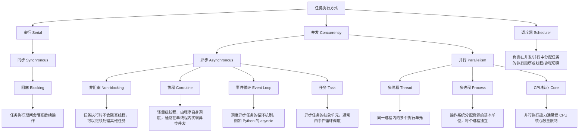

<!-- TODO：总结经验，了解全面并行编程，从megatron的data processing，并发api调用作为案例-->



好的，我们可以把这些概念梳理成一个层次清晰、包含关系明确的体系。我会从最基础的概念开始，然后逐步展开，并用图示化的思路帮助你理解。

---

## 1️⃣ 基础概念

1. **同步（Synchronous） vs 异步（Asynchronous）**

   * **同步**：调用方需要等待操作完成才能继续执行。

     ```text
     A -> B -> A 等待 B 完成
     ```
   * **异步**：调用方发出请求后可以继续执行，不必等待操作完成；完成后会有回调或通知。

     ```text
     A -> B 继续执行 A 的其他操作
     ```

2. **串行（Serial） vs 并发（Concurrent） vs 并行（Parallel）**

   * **串行**：任务按顺序执行，一次只做一个任务。

     ```
     任务1 → 任务2 → 任务3
     ```
   * **并发**：在同一个时间段内处理多个任务，但不一定是同时执行，多任务交替进行（时间片切换）。

     ```
     任务1 |----|
     任务2   |----|
     ```

     并发强调“同时进行”概念，但在单核 CPU 上实际上是交替执行。
   * **并行**：多任务在同一时间点真正同时执行，需要多核或多 CPU 支持。

     ```
     核心1: 任务1
     核心2: 任务2
     ```

     并行是并发的一种实现方式，但并发不一定是并行。

---

## 2️⃣ 执行单位

1. **进程（Process）**

   * 操作系统分配资源的基本单位。
   * 拥有独立内存空间、独立地址空间。
   * 进程之间通信需要 **IPC（进程间通信）**。
   * 可以是并发或并行的执行单位。

2. **线程（Thread）**

   * 属于进程的一部分，是 CPU 调度的基本单位。
   * 线程共享进程的内存空间。
   * 线程可以实现并发或并行（取决于 CPU 核数）。

3. **协程（Coroutine）**

   * 用户态的轻量级线程。
   * 由程序自己调度，不依赖操作系统内核调度。
   * 可以理解为**一种实现并发的手段**，通常用于异步编程。
   * 协程切换开销小，比线程更高效。

---

## 3️⃣ 包含关系（层次图）

```
执行单位:
    进程(Process)
        └── 线程(Thread)
               └── 协程(Coroutine)

执行方式:
    串行(Serial)
    并发(Concurrent)
        └── 并行(Parallel)   # 并行是并发的一种特殊情况
     
调用模式:
    同步(Synchronous)
    异步(Asynchronous)
```

* **关系说明**：

  1. 协程 < 线程 < 进程，是资源占用和调度粒度的递进关系。
  2. 并发和并行描述任务执行的时间逻辑，和进程/线程/协程可以组合使用。
  3. 同步/异步描述调用方是否等待结果，也可以与并发/并行组合使用。

---

### 4️⃣ 组合示例

| 执行单位 | 执行方式 | 调用模式  | 说明                |
| ---- | ---- | ----- | ----------------- |
| 单线程  | 串行   | 同步    | 最简单的程序执行方式        |
| 单线程  | 并发   | 异步    | Python asyncio 协程 |
| 多线程  | 并发   | 同步/异步 | 多任务交替执行，可利用多核     |
| 多进程  | 并行   | 同步/异步 | 充分利用多核 CPU，提高吞吐   |

---

如果你愿意，我可以帮你画一个**一张图把这些概念和包含关系全部可视化**，一眼就能看懂它们的层次和交叉关系。

你希望我画吗？


## 高层抽象与基本任务启动

对于日常简单任务，你可以直接使用 `threading.Thread` 或 `multiprocessing.Process` 来启动任务。但更推荐使用线程池/进程池模型来便于管理和调度任务。

### 直接启动任务

```python
import threading
import time

def task(n):
    print(f"线程 {n} 开始")
    time.sleep(1)
    print(f"线程 {n} 结束")

threads = []
for i in range(5):
    t = threading.Thread(target=task, args=(i,))
    t.start()
    threads.append(t)

for t in threads:
    t.join()

```

```python
import multiprocessing
import time

def task(n):
    print(f"进程 {n} 开始")
    time.sleep(1)
    print(f"进程 {n} 结束")

processes = []
for i in range(5):
    p = multiprocessing.Process(target=task, args=(i,))
    p.start()
    processes.append(p)

for p in processes:
    p.join()

```

### 使用线程池/进程池模型

Python 提供了方便的并发库如 `concurrent.futures`，可以使用线程池或进程池执行多个任务。

### ThreadPool 示例

```python
from concurrent.futures import ThreadPoolExecutor, as_completed
import time

def task(n):
    print(f"处理任务 {n}")
    time.sleep(1)
    return f"任务 {n} 完成"

with ThreadPoolExecutor(max_workers=3) as executor:
    futures = [executor.submit(task, i) for i in range(5)]
    for future in as_completed(futures):
        print(future.result())

```

### ProcessPool 示例

```python
from concurrent.futures import ProcessPoolExecutor, as_completed
import time

def task(n):
    print(f"处理任务 {n}")
    time.sleep(1)
    return f"任务 {n} 完成"

if __name__ == "__main__":
    with ProcessPoolExecutor(max_workers=3) as executor:
        futures = [executor.submit(task, i) for i in range(5)]
        for future in as_completed(futures):
            print(future.result())

```

---

## 常见问题及解决方案

多线程/多进程编程中经常会遇到一些典型问题，比如竞态条件（Race Condition）、死锁（Deadlock）和饥饿现象（Starvation）。以下是一些解决方案及代码示例。

### 竞态条件（Race Condition）

使用同步原语（例如，Lock, Semaphore, Event, Condition）来保证共享资源的互斥访问。

```python
import threading

counter = 0
lock = threading.Lock()

def increment():
    global counter
    for _ in range(100000):
        with lock:
            counter += 1

threads = [threading.Thread(target=increment) for _ in range(5)]
for t in threads:
    t.start()
for t in threads:
    t.join()

print("最终计数值:", counter)

```

### 死锁（Deadlock）

使用高级同步工具如 `RLock`（可重入锁）和 `Barrier` 可以更好地预防死锁。

```python
import threading

lock = threading.RLock()

def recursive_task(n):
    with lock:
        if n > 0:
            print(f"递归任务: {n}")
            recursive_task(n-1)

thread = threading.Thread(target=recursive_task, args=(5,))
thread.start()
thread.join()

```

### 饥饿现象（Starvation）

使用负载均衡工具（如 `Queue`、`Semaphore`）或者池来调控任务分配。

```python
import threading
import queue
import time
import random

task_queue = queue.Queue(maxsize=10)

def producer(name):
    while True:
        item = random.randint(1, 100)
        task_queue.put(item)
        print(f"生产者 {name} 生产了: {item}")
        time.sleep(random.random())

def consumer(name):
    while True:
        item = task_queue.get()
        print(f"消费者 {name} 消费了: {item}")
        time.sleep(random.random())
        task_queue.task_done()

# 启动生产者和消费者线程
threading.Thread(target=producer, args=("P1",), daemon=True).start()
threading.Thread(target=producer, args=("P2",), daemon=True).start()
threading.Thread(target=consumer, args=("C1",), daemon=True).start()
threading.Thread(target=consumer, args=("C2",), daemon=True).start()

# 主线程等待一段时间
time.sleep(5)

```

## 常见模型

下面是一些在多线程与多进程编程中常用的设计模型：

### 池模型

- 应用：线程池与进程池 (如上例 ThreadPoolExecutor / ProcessPoolExecutor)
- 优点：自动管理工作者线程/进程，调控并发数量

### 锁模型

- 应用：线程或进程间对共享资源的访问控制
- 同步工具：Lock, RLock, Semaphore, Condition

### 生产者-消费者模型

- 应用：任务调度，资源分配等场景 (参见上面的 producer_consumer 示例)

### 事件通知模型

- 应用：线程之间的等待与通知
- 工具：Event, Condition

```python
import threading
import time

event = threading.Event()

def wait_for_event():
    print("等待事件触发...")
    event.wait()
    print("事件已触发，继续执行！")

thread = threading.Thread(target=wait_for_event)
thread.start()

time.sleep(2)
event.set()
thread.join()

```

### 管道通信模型（适用于 multiprocessing）

- 管道与队列在多进程间传递数据

```python
from multiprocessing import Process, Pipe

def sender(conn):
    conn.send("消息通过管道传递")
    conn.close()

def receiver(conn):
    print("接收到:", conn.recv())

if __name__ == "__main__":
    parent_conn, child_conn = Pipe()
    p1 = Process(target=sender, args=(child_conn,))
    p2 = Process(target=receiver, args=(parent_conn,))
    p1.start()
    p2.start()
    p1.join()
    p2.join()

```

### 共享内存模型（适用于 multiprocessing）

- 使用 `multiprocessing.Value` 与 `multiprocessing.Array` 来分享内存数据

```python
from multiprocessing import Process, Value, Array

def modify_shared(n, a):
    n.value += 1
    for i in range(len(a)):
        a[i] = -a[i]

if __name__ == "__main__":
    num = Value('i', 0)
    arr = Array('i', range(10))
    p = Process(target=modify_shared, args=(num, arr))
    p.start()
    p.join()
    print("共享整数值:", num.value)
    print("共享数组:", list(arr))

```

## 总结

本教程对 Python 多线程与多进程编程进行了快速入门和常见问题的讨论，主要涵盖了：

- 如何直接启动线程与进程
- 线程池与进程池模型的使用（`submit` 与 `map` 等方法）
- 竞态条件、死锁和饥饿现象的解决方案
- 典型模型，包括池模型、锁模型、生产者-消费者、事件通知、管道通信以及共享内存

“线程安全”（**thread-safe**）指的是一个函数或代码片段在 **多线程环境下被同时调用时仍能正确工作**，不会出现数据混乱、状态错乱或不可预测的行为。

具体来说，有几个核心点：

---

### **1️⃣ 独立变量与共享状态**

* **独立变量**（局部变量）一般是线程安全的，因为每个线程有自己的副本。

  ```python
  def add_one(x):
      y = x + 1
      return y
  ```

  即使多个线程同时调用 `add_one(5)`，不会互相影响。
* **共享状态**（全局变量、可变对象）就可能不安全：

  ```python
  counter = 0
  def increment():
      global counter
      counter += 1  # 不是线程安全的
  ```

  多线程同时修改 `counter` 可能丢失更新，结果不对。

---

### **2️⃣ 外部依赖**

* 如果函数内部调用了数据库、文件、缓存或某些库，并且这些操作不是原子操作，也可能导致线程不安全。

  * 例：`get_similarity` 可能使用内部缓存或全局模型参数，如果模型对象在多个线程同时调用时修改了状态，就可能出错。
  * 线程安全的库或对象通常会在内部加锁或保证读写不会冲突。

---

### **3️⃣ 并发操作的风险**

* 数据丢失：两个线程同时写一个变量，其中一个写被覆盖。
* 状态错乱：内部状态部分更新，导致函数返回不一致或抛异常。
* 稀有 bug：可能只在高并发、特定时机触发，非常难复现。

---

### **4️⃣ 线程安全的判断**

* 如果函数只依赖传入参数和局部变量 → 一般线程安全。
* 如果函数依赖共享可变对象、缓存、数据库连接池等 → 需要确认库是否线程安全，或自己加锁。

---

💡 **总结一句话**：

> 线程安全就是“你可以同时用多个线程调用它而不出错，不会破坏内部状态或返回错误结果”。

---

我可以帮你分析你这个 `get_similarity` 是否可能存在 **线程不安全风险**，并给出改进方法。

你希望我帮你分析吗？
