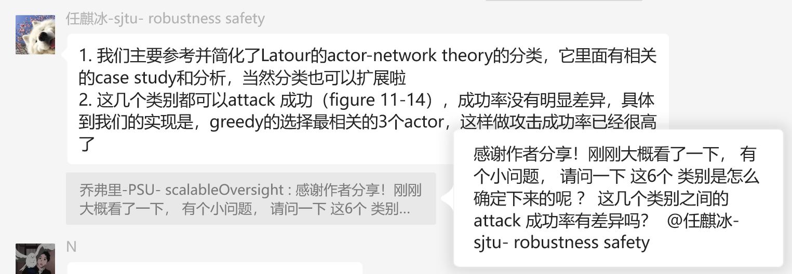

# LLM-Assisted Cross-disciplinary Inspiration and Innovation (LLM-CII) in Scientific Research

## Write an Article

- Literature is boosting
- Boundaries between disciplines are becoming vague
- Overlaps should be identified
- With LLMs, every research could be a logologist; AI + Science ⇒ Logology

## Craft a Prompt…

that could fuse differenet knowledges embedded in differenet  disciplines

## Questionnaire Survey

## Sample

学科交叉还有一个很重要的事情，比较偏nature/science一点的paper，就是AI辅助的科学发现

20世纪以前的学者，由于知识还未形成学科，没有边界和壁垒，因此可以是博学家

到了20世纪，知识疯狂增长，知识不得不圈地自封，形成细分，通过专业化分工来降低单个人的学习成本，便于科研边界的继续扩展。

专业化分工带来的缺陷是很显著的，知识本身没有边界，最终都是philosophy ，人为的边界让学科间的overlap变大，冗余变多。

到了今天，其实有越来越多的例子以及潜在的可能说明知识的融合，学科边界的消解是可能的 比如刚刚群里的两个例子，涵玉将要做的例子，子帆论文里对人脑推理过程的类比，还有很多。

潜在的可能就是，利用llm，单个人的能力范围可以再次扩大了，他的知识完全不需要局限于一个学科内部，所以一些重点可以是：

1. 如何利用llm提高一个人的跨学科能力

2. 利用llm产生的能力有用性如何

3. 能否估计人类知识中的冗余性

1. 完全可以通过给定不同学科的前沿话题，给定全面的学科类别，通过llm，按照概念类比的策略，看是否其他学科中的概念/框架/思路能够给出启发或者解答

2. 分发相关问题给相关领域的学者，收集他们对这些启发或者解答的评价，以此来评价有用性

3. 调查科学学，科学史的相关理论或者方法，通过量化的角度给出今天人类知识去重后的估计，以及知识的重复性。这能够启发全世界范围内，所有学科的方法论衰竭，研究动力匮乏，水论文现象严重的问题（这个是世界性问题）。

# Examples

---

Mapping between AI & Physics

---

AI + Lean

---

AI + Psychology

https://arxiv.org/abs/2310.17512
