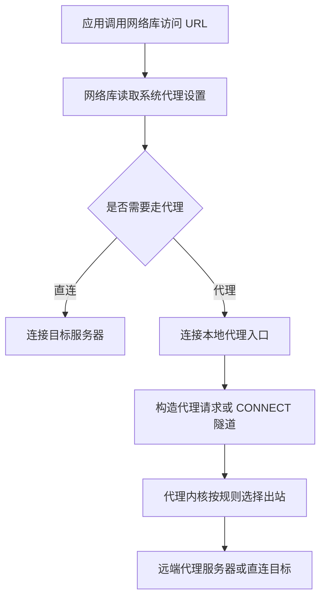

代理并不是某一个软件，也不是一个单独的开关。它更像是一条链路：本地应用把流量交给一个本地入口，本地入口根据规则决定出站方式，再由远端服务器把请求转发到真实目标。

理解这条链路之后，很多平时看起来零散的问题都会变得清楚：为什么浏览器能走代理而终端不行？为什么 `127.0.0.1` 在 WSL 里失效？为什么打开了“允许局域网连接”并不等于劫持所有流量？HTTP Proxy、SOCKS5、Clash、V2Ray、TUN、VPN 又分别在系统里扮演什么角色？

本文整理的是网络代理的通用技术理解。实际使用代理访问网络服务时，应遵守所在地区法律、组织安全政策和服务条款。

## 网络分层：先知道代理插在哪里



代理相关技术最容易混淆的地方，是它们并不工作在同一层。

| 层次 | 常见协议/组件 | 和代理的关系 |
| --- | --- | --- |
| 应用层 | HTTP、HTTPS、DNS、SSH | HTTP Proxy、浏览器代理、PAC、应用内代理主要在这一层发生 |
| 会话/应用层附近 | SOCKS5 | 通用 TCP/UDP 转发协议，应用主动把连接交给 SOCKS5 服务器 |
| 传输层 | TCP、UDP、TLS、QUIC | TLS/QUIC 负责加密和传输特性，很多代理协议会复用它们 |
| 网络层 | IP、路由表、虚拟网卡 | VPN、TUN 模式通过路由或虚拟网卡接管流量 |
| 数据链路层/物理层 | 以太网、Wi-Fi | 一般不是代理软件直接关注的重点 |

因此，“代理是否生效”不能只看某个客户端是否打开。还要看应用是否愿意把请求交给代理、操作系统是否配置了系统代理、DNS 是否走了预期路径、路由表是否被 TUN/VPN 改写。

## 一条代理链路由什么组成



一套代理系统通常包含以下部分：

| 组件 | 作用 | 常见例子 |
| --- | --- | --- |
| 本地客户端 | 在用户设备上提供本地入口、规则管理和图形界面 | Clash Verge Rev、v2rayN、Shadowrocket、Surge |
| 本地入口 | 应用连接到这里，把请求交给代理系统 | HTTP Proxy 端口、SOCKS5 端口、TUN 虚拟网卡 |
| 内核 | 真正负责协议处理、路由分流和转发 | mihomo、sing-box、V2Ray、Xray |
| 节点 | 一个远端服务器配置，包括地址、端口、协议、认证信息等 | Shadowsocks 节点、VLESS 节点、Trojan 节点 |
| 规则 | 判断哪些流量直连、代理、拒绝或走特定策略组 | `DOMAIN-SUFFIX`、`GEOIP`、`MATCH` |
| 策略组 | 在多个节点或策略之间做选择 | 自动选择、故障转移、手动选择 |
| 订阅 | 用 URL 集中更新节点和规则 | Clash YAML、sing-box JSON、V2Ray 订阅 |
| 远端服务器 | 接收本地客户端转发的流量，再访问真实目标 | 自建服务器或服务商节点 |

最小链路可以概括为：

```text
应用 -> 本地入口 -> 本地代理内核 -> 远端代理服务器 -> 目标网站/服务
```

这条链路里任何一段出错，表现都可能只是“连不上”。排查时要按链路逐段确认，而不是只盯着某一个开关。

## 代理、VPN 和 TUN 的区别

日常语境里很多人会把“代理”和“VPN”混用，但从系统行为看，它们差别很大。

| 类型 | 工作方式 | 应用是否需要主动配合 | 典型入口 | 适合场景 |
| --- | --- | --- | --- | --- |
| HTTP Proxy | 应用把 HTTP/HTTPS 请求发给代理服务器 | 需要 | `127.0.0.1:7890` | 浏览器、包管理器、命令行工具 |
| SOCKS5 | 应用把 TCP/UDP 连接交给 SOCKS5 服务器 | 需要 | `127.0.0.1:7891` | SSH、开发工具、支持 SOCKS 的应用 |
| TUN 模式 | 创建虚拟网卡并改写路由，让流量进入代理内核 | 通常不需要 | 虚拟网卡 | 接管不支持代理设置的应用 |
| VPN | 在网络层建立隧道，把流量交给远端网关 | 通常不需要 | 系统 VPN 接口 | 企业内网、全局加密隧道、远程组网 |

一个重要区别是：HTTP Proxy 和 SOCKS5 是“应用主动选择加入”，而 TUN/VPN 更接近“系统层接管”。如果某个应用完全不读取系统代理，也没有应用内代理设置，普通 HTTP/SOCKS 端口就不会影响它；这时才需要考虑 TUN 或 VPN。

“允许局域网连接”也容易被误解。它只是让本地代理入口从只监听 `127.0.0.1` 变成监听 `0.0.0.0` 或局域网地址，使 WSL、虚拟机、手机等设备可以连到这个端口。它不会自动劫持所有流量，真正的流量接管仍然取决于应用代理设置、系统代理、TUN 或路由规则。

## HTTP 代理如何工作

HTTP 代理最适合理解“代理请求”和“普通请求”的区别。

直连时，应用会直接连接目标服务器。例如访问 `http://example.com/path/page.html`，请求报文大致是：

```http
GET /path/page.html HTTP/1.1
Host: example.com
```

此时 TCP 连接的目标就是 `example.com:80`。请求行里只需要相对路径，因为服务器已经知道自己是谁。

走 HTTP Proxy 时，应用先连接代理服务器，例如 `127.0.0.1:7890`，再发送带有绝对 URI 的请求：

```http
GET http://example.com/path/page.html HTTP/1.1
Host: example.com
```

代理服务器看到完整 URL 后，才知道应该继续访问 `example.com`。

HTTPS 稍微不同。因为 HTTPS 内容被 TLS 加密，HTTP 代理不能直接读取里面的路径，所以客户端通常先发送 `CONNECT` 请求：

```http
CONNECT example.com:443 HTTP/1.1
Host: example.com:443
```

代理同意后，会建立一条 TCP 隧道。随后客户端和 `example.com` 在这条隧道里完成 TLS 握手，代理只负责转发加密后的字节流。

这里有一个关键点：代理服务器地址并不是写在 HTTP 报文里给网络自己发现的。应用或网络库先从系统代理、环境变量、PAC 文件或应用配置里读到代理地址，然后把底层 socket 连接目标改成代理服务器。

## 系统代理从哪里来

在现代操作系统里，很多应用并不会自己实现所有代理逻辑，而是调用系统或运行时提供的网络库。

以 Windows 上的 WinINet/WinHTTP 思路为例，一次代理请求大致经历这些步骤：



不同平台常见代理来源不同：

| 环境 | 常见代理来源 |
| --- | --- |
| Windows | 系统代理、WinINet、WinHTTP、应用内设置 |
| macOS | 系统网络设置、应用内设置 |
| Linux 桌面 | 桌面环境代理设置、应用内设置 |
| Linux 终端 | `http_proxy`、`https_proxy`、`all_proxy` 等环境变量 |
| 浏览器 | 系统代理、浏览器代理扩展、浏览器自身设置 |
| WSL/容器 | 环境变量、宿主机可访问地址、TUN/VPN 影响 |

这也是为什么“浏览器可以访问，终端不行”很常见：浏览器读到了系统代理，而终端程序通常只看环境变量或自己的配置。

## `127.0.0.1`、`0.0.0.0` 和 WSL

WSL 代理问题的核心，是理解监听地址。

| 监听地址 | 含义 | 谁能访问 |
| --- | --- | --- |
| `127.0.0.1` | 只监听本机回环接口 | 通常只有同一个网络命名空间里的本机应用 |
| `0.0.0.0` | 监听所有 IPv4 网络接口 | 本机、局域网设备、虚拟机/WSL 等可能都能访问 |
| 局域网 IP | 只监听某个具体网卡地址 | 能访问该网卡地址的设备 |

如果 Windows 上的代理客户端只监听 `127.0.0.1:7890`，WSL 里访问 `127.0.0.1:7890` 时，含义可能变成“WSL 自己的 localhost”，而不是 Windows 宿主机的 localhost。解决思路通常有三种：

1. 在代理客户端里打开 `Allow LAN` / “允许局域网连接”，让入口监听到 Windows 的局域网地址。
2. 在 WSL 里把代理地址设为 Windows 宿主机 IP，而不是写死 `127.0.0.1`。
3. 使用 TUN/VPN 这类系统层接管方式，让应用无需单独理解代理地址。

在 WSL 中常见的终端配置方式如下，端口以本地客户端实际显示为准：

```bash
export http_proxy="http://<windows-host-ip>:7890"
export https_proxy="http://<windows-host-ip>:7890"
export all_proxy="socks5://<windows-host-ip>:7891"
```

如果只是临时调试，也可以直接指定代理：

```bash
curl -x http://<windows-host-ip>:7890 https://example.com
```

打开 `Allow LAN` 后要注意防火墙和局域网暴露面。代理端口如果对同一网络里的其他设备开放，最好配合防火墙限制来源地址。

## DNS 也是代理体验的一部分

很多代理问题表面上是连接失败，实际是 DNS 出错。常见差异包括：

- HTTP Proxy：对于普通 HTTP 请求，代理可以根据绝对 URI 自己解析目标域名。
- HTTPS CONNECT：客户端把目标主机名交给代理，代理通常负责连接目标地址。
- SOCKS5：既可以本地解析后把 IP 交给代理，也可以把域名交给代理远端解析，具体取决于客户端实现和配置。
- TUN/VPN：可能通过 DNS 劫持、fake-ip、远端 DNS 或系统 DNS 改写来处理域名。

如果出现“IP 能通、域名不通”“某些网站被错误直连”“规则命中了但仍然失败”，DNS 配置就应该进入排查清单。

## 常见协议速览

下面这些名称经常同时出现在客户端、订阅和节点配置里，但它们并不是同一类东西。有的是代理协议，有的是传输层，有的是 VPN 协议，有的是混淆方案。

| 名称 | 类型 | 简要说明 |
| --- | --- | --- |
| HTTP Proxy | 应用层代理 | 主要处理 HTTP/HTTPS；HTTPS 通常通过 `CONNECT` 建立隧道 |
| SOCKS5 | 通用代理协议 | 支持 TCP，也可支持 UDP；常用于程序级代理 |
| Shadowsocks | 加密代理协议 | 轻量、简单，常见于个人代理场景 |
| ShadowsocksR | Shadowsocks 衍生协议 | 增加协议和混淆插件，生态相对老旧 |
| VMess | V2Ray 协议 | V2Ray 生态早期常用协议，支持多种传输组合 |
| VLESS | V2Ray/Xray 协议 | 更轻量，通常与 TLS、XTLS、Reality 等组合使用 |
| Trojan | 基于 TLS 的代理协议 | 外观接近普通 HTTPS 连接，常部署在 443 端口 |
| Reality | Xray 生态传输/伪装方案 | 常与 VLESS 搭配，重点在 TLS 握手层面的抗探测 |
| Hysteria2 | 基于 UDP/QUIC 思路的代理协议 | 面向高丢包、高延迟网络优化吞吐和稳定性 |
| WireGuard | VPN 协议 | 现代网络层隧道，配置简洁、性能好 |
| OpenVPN/IKEv2 | VPN 协议 | 传统 VPN 方案，企业和个人场景都常见 |
| Obfs4/meek/Snowflake | 混淆/桥接方案 | 常见于 Tor 生态，用于降低协议特征 |

选择协议时不能只看“速度”。更现实的维度包括：客户端是否支持、服务端是否易部署、网络环境是否丢包、是否需要 UDP、是否需要伪装、维护状态是否稳定、是否方便排查。

## 客户端、内核和 GUI

代理工具生态里最容易混淆的是“内核”和“GUI”。GUI 负责让人配置和切换，内核负责实际处理流量。一个 GUI 可能支持多个内核，一个内核也可以被多个 GUI 使用。

| 类别 | 常见项目 | 作用 |
| --- | --- | --- |
| Clash/mihomo 生态 | 、 | 规则分流、策略组、Clash YAML 生态 |
| sing-box 生态 |  | 多协议代理平台，配置以 JSON 为主 |
| V2Ray/Xray 生态 | V2Ray、Xray、v2rayN、v2rayNG | VMess、VLESS、Trojan 等协议生态 |
| Shadowsocks 生态 | shadowsocks-rust、Outline 等 | Shadowsocks 协议实现与客户端 |
| VPN 生态 | WireGuard、OpenVPN、Tailscale | 网络层隧道或组网 |

常见客户端可以按平台粗略理解：

| 平台 | 常见工具 |
| --- | --- |
| Windows | v2rayN、Clash Verge Rev、Nekoray、sing-box GUI |
| macOS | Clash Verge Rev、ClashX、Surge、Stash、sing-box GUI |
| Linux 桌面/服务器 | mihomo、sing-box、v2rayA、Nekoray |
| Android | v2rayNG、NekoBox、Surfboard、Clash Meta for Android |
| iOS/iPadOS | Shadowrocket、Quantumult X、Surge、Stash |

具体项目的维护状态会变化，选型时应以项目主页和社区实际活跃度为准。对普通用户来说，优先选择仍在维护、文档清楚、配置格式常见、日志可读的工具。

## Clash 生态的几个名字

Clash 之所以重要，不只是因为它是一个客户端或内核，还因为它的 YAML 订阅格式、规则写法和策略组模型被大量工具继承。

| 项目 | 角色 |
| --- | --- |
|  | 原始 Clash 内核项目 |
|  | 原始 Clash 的备份 |
|  | Clash Meta/mihomo 内核，延续并扩展 Clash 生态 |
|  | 曾经流行的 Windows/macOS/Linux GUI |
|  | 曾经流行的跨平台 GUI |
|  | Clash Verge 的延续项目之一 |

一个最小 Clash 节点配置大致长这样：

```yaml
proxies:
  - name: "MySS"
    type: ss
    server: example.com
    port: 8388
    cipher: aes-128-gcm
    password: "mypassword"

  - name: "MyVmess"
    type: vmess
    server: vmess.example.com
    port: 443
    uuid: "xxxx-xxxx-xxxx-xxxx"
    alterId: 0
    network: ws
```

真正完整的配置通常还会包含 `proxy-groups` 和 `rules`：

```yaml
proxy-groups:
  - name: "Proxy"
    type: select
    proxies:
      - "MySS"
      - "MyVmess"
      - DIRECT

rules:
  - DOMAIN-SUFFIX,example.com,Proxy
  - GEOIP,CN,DIRECT
  - MATCH,Proxy
```

规则一般是从上到下匹配。前面的规则越具体，越应该放在前面；最后通常用 `MATCH` 兜底。策略组则负责把“走代理”进一步映射到某个具体节点、自动测速组或故障转移组。

## 订阅、规则和策略组

订阅解决的是“配置如何更新”的问题。服务商或自建面板通常提供一个订阅 URL，客户端定期拉取并转换为自己能理解的配置。

规则解决的是“哪些流量怎么走”的问题。常见策略包括：

- 国内常见站点直连，国外站点走代理。
- 某些服务固定走特定地区节点。
- 广告、恶意域名或遥测域名拒绝连接。
- 局域网、内网、私有地址永远直连。
- 兜底规则根据个人需求选择直连或代理。

策略组解决的是“走代理时选谁”的问题。常见策略组包括：

- `select`：手动选择节点。
- `url-test`：按延迟自动选择。
- `fallback`：当前节点失败后切换。
- `load-balance`：在多个节点之间分散请求。

配置复杂时，建议把问题拆成三层看：节点是否可用、规则是否命中、策略组是否选到了正确节点。

## Linux 和服务器场景

Linux 上使用代理通常分两类：桌面 GUI 和服务器/终端。

终端里最常用的是环境变量：

```bash
export http_proxy="http://127.0.0.1:7890"
export https_proxy="http://127.0.0.1:7890"
export all_proxy="socks5://127.0.0.1:7891"
```

取消代理：

```bash
unset http_proxy
unset https_proxy
unset all_proxy
```

如果是在服务器上跑本地代理客户端，可以选择直接运行 mihomo、sing-box、V2Ray/Xray，也可以使用 v2rayA 这类 Web UI 管理。v2rayA 的常见思路是：

1. 安装 V2Ray/Xray 核心。
2. 安装 v2rayA。
3. 启动 v2rayA 服务并进入 Web UI。
4. 导入订阅或节点。
5. 在终端或系统服务里配置 `http_proxy` / `https_proxy`。

这里不要依赖固定版本号。安装命令、包名和服务名会随发行版与项目更新变化，实际操作应以项目 README 或 release 页面为准。

## 常见排查清单

代理问题最好按链路排查。

1. 本地客户端是否启动，HTTP/SOCKS/TUN 入口端口是否存在。
2. 应用是否真的读取了代理配置。
3. 终端是否设置了 `http_proxy`、`https_proxy` 或 `all_proxy`。
4. WSL/虚拟机访问的是宿主机地址，还是自己的 `127.0.0.1`。
5. `Allow LAN` 是否打开，防火墙是否允许访问本地代理端口。
6. 规则是否命中预期策略组。
7. 策略组当前选中的节点是否可用。
8. DNS 是否按预期解析，是否出现本地 DNS 泄漏或污染。
9. IPv6 是否影响了连接路径。
10. TUN/VPN 是否有管理员权限，路由表是否被正确写入。

几个常用测试命令：

```bash
curl -x http://127.0.0.1:7890 https://example.com -I
curl --socks5 127.0.0.1:7891 https://example.com -I
```

如果使用的是 WSL，把 `127.0.0.1` 换成 Windows 宿主机 IP 再测一次。若浏览器可用但命令行不可用，优先检查环境变量；若命令行可用但某个应用不可用，优先检查这个应用是否支持系统代理或是否需要应用内单独配置。

## 一个简化心智模型

遇到代理问题时，可以用下面这个模型快速定位：

```text
应用是否把流量交给代理？
  -> 没有：检查系统代理、应用代理、环境变量、TUN/VPN
  -> 有：检查本地入口端口和监听地址
      -> 入口正常：检查规则和策略组
          -> 规则正常：检查节点、远端服务器、DNS、IPv6
```

这比记住某个客户端的按钮更重要。客户端会换，协议会更新，GUI 会分叉，但底层问题基本都逃不开这条链路。

## 参考资料

- [Clash 知识库](https://clash.wiki/)
- [MetaCubeX 客户端列表](https://wiki.metacubex.one/startup/client/client/)
- [v2rayA](https://github.com/v2rayA/v2rayA)
- [V2Fly 安装脚本](https://github.com/v2fly/fhs-install-v2ray)
- [v2rayN 系统代理路由说明](https://github.com/2dust/v2rayN/wiki/Description-of-system-proxy-routing)
- [V2Ray 搭建示例](https://bwgvps.github.io/build-v2ray-on-bandwagonhost-vps/)
- [代理协议参考文章](https://www.techfens.com/posts/kexueshangwang.html)
