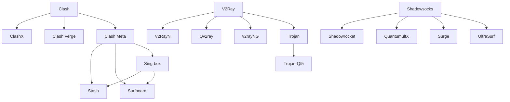

## TODO

- [ ] 待阅读：[各种协议的介绍](https://www.techfens.com/posts/kexueshangwang.html)

## 计算机网络基础知识



- 应用层：指用户直接交互的层次，处理具体的应用协议（如 HTTP、FTP、DNS、SMTP 等）。
- 表示层：负责数据格式转换、加密解密和数据压缩等功能，确保不同系统间的数据能正确理解。
- 会话层：管理会话连接，负责建立、维护和终止会话。
- 传输层：提供端到端的通信服务，常见协议有 TCP（可靠传输）和 UDP（不可靠传输）。
- 网络层：负责数据包的路由选择和转发，常见协议有 IP（IPv4/IPv6）。
- 数据链路层：负责在物理网络上可靠传输数据帧，常见协议有以太网、Wi-Fi。
- 物理层：涉及实际的硬件传输介质和信号传输。

## 代理软件基础


- 协议：定义数据传输的规则和格式，如 Shadowsocks、V2Ray、Trojan 等。
- 客户端：运行在用户设备上，负责将本地流量通过代理
- 服务器：运行在远程服务器上，接收客户端流量并转发到目标地址。
- 内核：处理网络请求和数据包转发的核心组件，决定代理的性能和功能。比如 Clash、Sing-box、V2Ray 等。
- 规则：定义哪些流量走代理，哪些直连，常见格式有 Clash 的 YAML 规则。
- 订阅：集中管理和更新代理节点和规则的方式，通常通过 URL 获取最新配置。
- 图形界面（GUI）：提供用户友好的操作界面，简化配置和管理过程。包括客户端、终端、浏览器UI等。
- 机场/服务商：提供代理服务器节点和相关服务的供应商，通常按流量或时间收费。


## 名词解释

- VPN：虚拟私有网络（Virtual Private Network），在网络层或链路层建立加密隧道，将全部或部分流量通过远端网关转发。常见实现包括 WireGuard、OpenVPN、IKEv2 等，适合需要全局流量加密或访问内网资源的场景。
- SOCKS5：一种通用的代理协议，工作在会话层/应用层，支持 TCP 和 UDP 转发，能代理任意 TCP/UDP 流量（例如 SSH、DNS、游戏），常用于程序级代理或与像 Shadowsocks 这样的加密代理结合使用。
- HTTP Proxy：专门代理 HTTP/HTTPS 流量的代理协议，通常仅处理基于 HTTP 的请求；通过 CONNECT 方法可以建立到任意主机的隧道，但对非 HTTP 协议支持有限。
- TLS / SSL：传输层安全协议，用于在客户端和服务器间建立加密通道，很多代理协议（如 Trojan）依赖 TLS 来伪装流量和提供加密。
- XTLS：一种针对代理和混淆优化的传输层协议扩展，降低握手开销并增强抗探测能力（常见于 V2Ray 的 XTLS 实现）。
- QUIC：基于 UDP 的传输层协议，实现了多路复用、连接迁移与低延迟，像 Hysteria2 会基于 QUIC/QUIC-like 实现以提升速度与抗丢包能力。
- DPI（深度包检测）：网络审查常用的检测技术，通过分析数据包内容识别协议特征，混淆和伪装技术用于规避 DPI。
- 混淆 / 伪装：把代理流量变形为看似正常或随机的数据，以绕过协议识别（例：Obfs4、meek、Trojan 用 TLS 伪装为 HTTPS）。
- 端到端加密 vs 传输层加密：端到端加密是指应用层数据在端点之间加密；传输层加密（如 TLS）保护传输过程中的数据。两者关注点不同但常常结合使用。
- clash 是一个2018年左右推出的，Go语言编写的跨平台代理客户端，支持多种代理协议（如 Shadowsocks、V2Ray、Trojan 等），以规则为基础进行流量分流和管理。clash 以其高性能、灵活的配置和强大的功能迅速成为翻墙用户的首选工具之一。其yaml订阅格式也被广泛采用，成为跨平台代理工具的事实标准，可以支持SS/SSR/Vmess/Trojan 等多种协议。还支持各种规则，策略组等信息。
  ```yaml
  proxies:
  - name: "MySS"
    type: ss
    server: example.com
    port: 8388
    cipher: aes-128-gcm
    password: "mypassword"

  - name: "MyVmess"
    type: vmess
    server: vmess.example.com
    port: 443
    uuid: "xxxx-xxxx-xxxx-xxxx"
    alterId: 0
    network: ws
  ```

## 📦 主流翻墙工具清单（客户端）

按平台和核心分类整理如下：

### 🖥️ 桌面端（Windows/macOS/Linux）

| 工具名         | 平台       | 核心/协议支持       | 特点 |
|----------------|------------|----------------------|------|
| Clash          | Win/macOS/Linux | 多协议（SS/V2Ray/Trojan） | 高性能，规则分流 |
| ClashX         | macOS      | Clash GUI            | macOS 专用图形界面 |
| Clash Verge    | Win/macOS  | Clash Premium        | 多功能 GUI |
| Clash Meta     | 多平台     | 增强版 Clash         | 支持 Reality/VLESS 等新协议 |
| Sing-box       | 多平台     | 新一代核心           | 高性能，支持 Hysteria2 等 |
| V2RayN         | Windows    | V2Ray                | 支持 VMess/VLESS |
| Qv2ray         | Win/macOS/Linux | V2Ray GUI         | 跨平台图形界面 |
| Trojan-Qt5     | Windows/macOS | Trojan             | 简洁 GUI |
| Psiphon        | Win/macOS  | VPN/SSH/HTTP Proxy   | 免费，抗封锁强 |
| UltraSurf      | Windows    | HTTP Proxy           | 同上，轻量级 |

### 📱 移动端（iOS/Android）

| 工具名         | 平台       | 核心/协议支持       | 特点 |
|----------------|------------|----------------------|------|
| Shadowrocket   | iOS        | 多协议               | 功能强大，支持脚本 |
| QuantumultX    | iOS        | 多协议               | 高级用户首选 |
| Surge          | iOS/macOS  | 多协议+调试功能      | 开发者友好 |
| Stash          | iOS        | Clash/Sing-box       | 新秀，界面现代 |
| Surfboard      | iOS/Android| Clash/Sing-box       | 简洁易用 |
| v2rayNG        | Android    | V2Ray                | Android 上的主力 |
| Nekoray        | Windows/Linux | V2Ray/SS/Trojan   | 轻量 GUI，支持多协议 |

---

## 🌱 工具衍生关系图



---

## 🔐 常见协议与原理简述

| 协议名称     | 原理简述 |
|--------------|----------|
| **Shadowsocks (SS)** | 基于 SOCKS5 的加密代理，轻量快速，抗封锁能力中等 |
| **ShadowsocksR (SSR)** | SS 的改进版，增加混淆与协议插件，抗封锁更强 |
| **VMess**     | V2Ray 专属协议，支持动态端口与加密，抗封锁强 |
| **VLESS**     | VMess 的无认证版本，适合与 TLS/XTLS 搭配使用 |
| **Trojan**    | 模拟 HTTPS 流量，使用 TLS 加密，伪装性强 |
| **Reality**   | Trojan 的进化版，支持 XTLS Vision，抗主动探测 |
| **Hysteria2** | 基于 QUIC 的协议，速度快，抗干扰强 |
| **WireGuard (VPN)** | 现代 VPN 协议，轻量高效，适合全局代理与网络层隧道 |
| **OpenVPN / IKEv2 (VPN)** | 传统 VPN 协议族，成熟、互操作性好，常用于企业与个人连接 |
| **SOCKS5** | 应用层代理协议，支持 TCP/UDP 转发，常用于程序级代理与端口转发 |
| **HTTP Proxy** | 适用于 HTTP/HTTPS 请求的代理，结合 CONNECT 可做隧道，但对非 HTTP 支持有限 |
| **Obfs4/Meek/Snowflake** | Tor 的混淆插件，用于突破 DPI 检测 |
| **SSU (I2P)** | UDP 混淆协议，抗封锁极强，适用于匿名网络 |


## 历史

- 2023 年 11 月 2 日  作者删库
- 2023 年 11 月 3 日  作者删库
- 2018 年 6 月 10 日  诞生