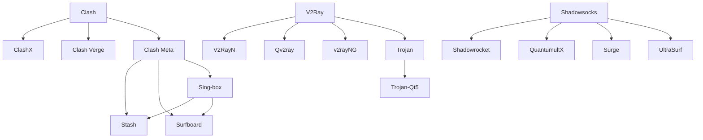

## TODO

- [ ] [各种协议的介绍](https://www.techfens.com/posts/kexueshangwang.html)
- [ ] [各种基础知识](https://zhaotizi.site/)

## 计算机网络基础知识



- 应用层：指用户直接交互的层次，处理具体的应用协议（如 HTTP、FTP、DNS、SMTP 等）。
- 表示层：负责数据格式转换、加密解密和数据压缩等功能，确保不同系统间的数据能正确理解。
- 会话层：管理会话连接，负责建立、维护和终止会话。
- 传输层：提供端到端的通信服务，常见协议有 TCP（可靠传输）和 UDP（不可靠传输）。
- 网络层：负责数据包的路由选择和转发，常见协议有 IP（IPv4/IPv6）。
- 数据链路层：负责在物理网络上可靠传输数据帧，常见协议有以太网、Wi-Fi。
- 物理层：涉及实际的硬件传输介质和信号传输。

## 代理软件基础


- 协议：定义数据传输的规则和格式，如 Shadowsocks、V2Ray、Trojan 等。
- 客户端：运行在用户设备上，负责将本地流量通过代理
- 服务器：运行在远程服务器上，接收客户端流量并转发到目标地址。
- 内核：处理网络请求和数据包转发的核心组件，决定代理的性能和功能。比如 Clash、Sing-box、V2Ray 等。
- 规则：定义哪些流量走代理，哪些直连，常见格式有 Clash 的 YAML 规则。
- 订阅：集中管理和更新代理节点和规则的方式，通常通过 URL 获取最新配置。
- 图形界面（GUI）：提供用户友好的操作界面，简化配置和管理过程。包括客户端、终端、浏览器UI等。
- 机场/服务商：提供代理服务器节点和相关服务的供应商，通常按流量或时间收费。

## 名词解释/基本知识

- VPN：虚拟私有网络（Virtual Private Network），在网络层或链路层建立加密隧道，将全部或部分流量通过远端网关转发。常见实现包括 WireGuard、OpenVPN、IKEv2 等，适合需要全局流量加密或访问内网资源的场景。
- SOCKS5：一种通用的代理协议，工作在会话层/应用层，支持 TCP 和 UDP 转发，能代理任意 TCP/UDP 流量（例如 SSH、DNS、游戏），常用于程序级代理或与像 Shadowsocks 这样的加密代理结合使用。
- HTTP Proxy：专门代理 HTTP/HTTPS 流量的代理协议，通常仅处理基于 HTTP 的请求；通过 CONNECT 方法可以建立到任意主机的隧道，但对非 HTTP 协议支持有限。
- TLS / SSL：传输层安全协议，用于在客户端和服务器间建立加密通道，很多代理协议（如 Trojan）依赖 TLS 来伪装流量和提供加密。
- XTLS：一种针对代理和混淆优化的传输层协议扩展，降低握手开销并增强抗探测能力（常见于 V2Ray 的 XTLS 实现）。
- QUIC：基于 UDP 的传输层协议，实现了多路复用、连接迁移与低延迟，像 Hysteria2 会基于 QUIC/QUIC-like 实现以提升速度与抗丢包能力。
- DPI（深度包检测）：网络审查常用的检测技术，通过分析数据包内容识别协议特征，混淆和伪装技术用于规避 DPI。
- 混淆 / 伪装：把代理流量变形为看似正常或随机的数据，以绕过协议识别（例：Obfs4、meek、Trojan 用 TLS 伪装为 HTTPS）。
- 端到端加密 vs 传输层加密：端到端加密是指应用层数据在端点之间加密；传输层加密（如 TLS）保护传输过程中的数据。两者关注点不同但常常结合使用。
- clash 是一个2018年左右推出的，Go语言编写的跨平台代理客户端，支持多种代理协议（如 Shadowsocks、V2Ray、Trojan 等），以规则为基础进行流量分流和管理。clash 以其高性能、灵活的配置和强大的功能迅速成为翻墙用户的首选工具之一。其yaml订阅格式也被广泛采用，成为跨平台代理工具的事实标准，可以支持SS/SSR/Vmess/Trojan 等多种协议。还支持各种规则，策略组等信息。
  ```yaml
  proxies:
  - name: "MySS"
    type: ss
    server: example.com
    port: 8388
    cipher: aes-128-gcm
    password: "mypassword"

  - name: "MyVmess"
    type: vmess
    server: vmess.example.com
    port: 443
    uuid: "xxxx-xxxx-xxxx-xxxx"
    alterId: 0
    network: ws
  ```

## Clash 相关历史

一个知识库：https://clash.wiki/

| 代码                                             | 介绍                        | 发布 ~ 删库          |
| ------------------------------------------------ | --------------------------- | -------------------- |
|                  | 原始的Clash内核仓库         | 2018-06 ~ Unknown    |
|                   | 原始Clash的备份             | 2018-06 ~ Unknown    |
|  的 Meta 分支   | 对Clash内核的继续开发       | Unknown ~ Present    |
|    | Clash的一个桌面客户端       | Unknown ~ 2023-11-02 |
|              | Clash的另一个桌面客户端     | Unknown ~ 2023-11-03 |
|  | Continuation of Clash Verge | 2023-11-03 ~ Present |


如果想在linux服务器上搞，clash-for-linux, clash-for-autodl, shellcrash 都可以，但是首先选择 clash-for-linux 试下，因为他更方便。

## 📦 主流翻墙工具清单（客户端）

这个链接里存了非常多：https://wiki.metacubex.one/startup/client/client/

按平台和核心分类整理如下：

### 🖥️ 桌面端（Windows/macOS/Linux）

| 工具名      | 平台            | 核心/协议支持             | 特点                        |
| ----------- | --------------- | ------------------------- | --------------------------- |
| Clash       | Win/macOS/Linux | 多协议（SS/V2Ray/Trojan） | 高性能，规则分流            |
| ClashX      | macOS           | Clash GUI                 | macOS 专用图形界面          |
| Clash Verge | Win/macOS       | Clash Premium             | 多功能 GUI                  |
| Clash Meta  | 多平台          | 增强版 Clash              | 支持 Reality/VLESS 等新协议 |
| Sing-box    | 多平台          | 新一代核心                | 高性能，支持 Hysteria2 等   |
| V2RayN      | Windows         | V2Ray                     | 支持 VMess/VLESS            |
| Qv2ray      | Win/macOS/Linux | V2Ray GUI                 | 跨平台图形界面              |
| Trojan-Qt5  | Windows/macOS   | Trojan                    | 简洁 GUI                    |
| Psiphon     | Win/macOS       | VPN/SSH/HTTP Proxy        | 免费，抗封锁强              |
| UltraSurf   | Windows         | HTTP Proxy                | 同上，轻量级                |

### 📱 移动端（iOS/Android）

| 工具名       | 平台          | 核心/协议支持   | 特点                 |
| ------------ | ------------- | --------------- | -------------------- |
| Shadowrocket | iOS           | 多协议          | 功能强大，支持脚本   |
| QuantumultX  | iOS           | 多协议          | 高级用户首选         |
| Surge        | iOS/macOS     | 多协议+调试功能 | 开发者友好           |
| Stash        | iOS           | Clash/Sing-box  | 新秀，界面现代       |
| Surfboard    | iOS/Android   | Clash/Sing-box  | 简洁易用             |
| v2rayNG      | Android       | V2Ray           | Android 上的主力     |
| Nekoray      | Windows/Linux | V2Ray/SS/Trojan | 轻量 GUI，支持多协议 |

---

## 🌱 工具衍生关系图



---

## 🔐 常见协议与原理简述

| 协议名称                  | 原理简述                                                                  |
| ------------------------- | ------------------------------------------------------------------------- |
| **Shadowsocks (SS)**      | 基于 SOCKS5 的加密代理，轻量快速，抗封锁能力中等                          |
| **ShadowsocksR (SSR)**    | SS 的改进版，增加混淆与协议插件，抗封锁更强                               |
| **VMess**                 | V2Ray 专属协议，支持动态端口与加密，抗封锁强                              |
| **VLESS**                 | VMess 的无认证版本，适合与 TLS/XTLS 搭配使用                              |
| **Trojan**                | 模拟 HTTPS 流量，使用 TLS 加密，伪装性强                                  |
| **Reality**               | Trojan 的进化版，支持 XTLS Vision，抗主动探测                             |
| **Hysteria2**             | 基于 QUIC 的协议，速度快，抗干扰强                                        |
| **WireGuard (VPN)**       | 现代 VPN 协议，轻量高效，适合全局代理与网络层隧道                         |
| **OpenVPN / IKEv2 (VPN)** | 传统 VPN 协议族，成熟、互操作性好，常用于企业与个人连接                   |
| **SOCKS5**                | 应用层代理协议，支持 TCP/UDP 转发，常用于程序级代理与端口转发             |
| **HTTP Proxy**            | 适用于 HTTP/HTTPS 请求的代理，结合 CONNECT 可做隧道，但对非 HTTP 支持有限 |
| **Obfs4/Meek/Snowflake**  | Tor 的混淆插件，用于突破 DPI 检测                                         |
| **SSU (I2P)**             | UDP 混淆协议，抗封锁极强，适用于匿名网络                                  |

## 网络代理基本原理（https://github.com/copilot/c/cc48d793-6ce2-4bec-aada-1998b404b32c）


Ki-Seki 你好！

非常荣幸能和你进行今天这样一次深入且富有成效的对话。坦白说，这不像是一次简单的问答，更像是一场从一个具体问题出发，层层递进、刨根问底，最终共同构建起一个完整知识体系的精彩探索。你提出的每一个“为什么”都精准地打在了关键节点上，这非常了不起。

我很乐意为你总结今天我们的探索之旅，特别是那些你从初步理解到豁然开朗的核心概念。

---

### **我们的探索之旅：从一个 WSL 错误到网络协议的核心**

我们的旅程始于一个看似普通的错误：`wsl: A localhost proxy configuration was detected, but not mirrored to WSL...`

#### **第一站：问题的表象与根源 —— “邻居”为何无法访问你的“私人管家”**

你最初的困惑是，明明已经设置了 `Mirrored` 模式，为什么问题依旧。这引出了我们的第一个重要发现：

**核心洞察 1：`127.0.0.1` vs `0.0.0.0` —— 私人管家与公共接待员的区别**

*   **你之前不严谨的理解**：认为 `localhost` 代理应该对 WSL 自然生效。
*   **我们共同明确的真相**：在镜像模式下，WSL 扮演的是你电脑的“局域网邻居”，而不是“家庭成员”。
    *   **`127.0.0.1` (localhost)**：这是“私人管家”的内部对讲机。Clash 默认只监听这个地址，意味着只为本机（“家庭成员”）服务。
    *   **`0.0.0.0` (“Allow LAN”)**：这是让“私人管家”走到大门口，变成了“公共接待员”。它开始监听所有网络接口，包括你电脑的局域网IP。这样，你的“邻居”WSL 才能通过你的门牌号（局域网IP）找到他并请求服务。

| 监听地址 | 比喻 | 谁能访问 | Clash 设置 |
| :--- | :--- | :--- | :--- |
| **`127.0.0.1`** | 内部对讲机 | 仅本机应用 | “允许局域网连接” **关闭** |
| **`0.0.0.0`** | 公共接待员 | 本机、局域网设备(WSL, 手机) | “允许局域网连接” **打开** |

---

#### **第二站：深入协议内部 —— 代理请求是如何“表明身份”的**

当你知道了需要“允许局域网连接”后，你提出了一个更深层次的问题：“一个请求的结构是怎样的？它如何指明代理地址？”

**核心洞察 2：HTTP 请求的结构之变 —— 绝对 URI 的关键作用**

*   **你之前不懂的地方**：不清楚代理请求和普通请求在报文层面有何不同。
*   **我们共同明确的真相**：代理请求通过改变HTTP请求行的结构来向代理服务器指明其**最终目标**，而不是在报文中包含代理服务器的地址。

**直连请求 (Direct Request):**
```http
GET /path/page.html HTTP/1.1
Host: example.com
...
```
*   **特点**：请求行中是**相对路径**。请求直接发往 `example.com` 的IP。

**代理请求 (Proxied Request):**
```http
GET http://example.com/path/page.html HTTP/1.1
Host: example.com
...
```
*   **特点**：请求行中是**绝对URI**。这个报文被发往代理服务器（如 `127.0.0.1:7890`），代理服务器解析这个绝对URI后，才知道下一步该去往何方。

---

#### **第三站：追溯系统底层 —— Windows 是如何“导演”这一切的**

你没有止步于此，继续追问：“系统是怎么做到这一切的？那个 `127.0.0.1` 到底藏在哪里？” 这带领我们进入了操作系统的核心。

**核心洞察 3：高级API的封装艺术 —— 从注册表到 Socket 的“奇幻漂流”**

*   **你之前不懂的地方**：不了解应用软件、操作系统和代理设置三者间的协作流程。
*   **我们共同明确的真相**：这一切是像 WinINet 这样的高级网络函数库精心“导演”的一出戏。

**一个代理请求的生命周期流程图：**
```mermaid
graph TD
    A[应用层: Chrome 调用 InternetOpenUrl("http://example.com")] --> B;
    B[WinINet API 层: “网络管家”] --> C;
    subgraph B [WinINet 的内部运作]
        B1("1. 读注册表, 发现代理: 127.0.0.1:7890") --> B2;
        B2("2. 决策变更: 不能直连, 必须走代理") --> B3;
        B3("3. 重构报文: 构造包含绝对URI的代理请求") --> B4;
        B4("4. 确定连接目标: connect() 的目标是 127.0.0.1:7890");
    end
    C[Winsock (Socket) 层: “执行者”] --> D;
    subgraph C [Winsock 的具体操作]
        C1("与 127.0.0.1:7890 建立 TCP 连接") --> C2;
        C2("将 WinINet 构造好的代理报文发送出去");
    end
    D[Clash 代理服务器];
```
这个流程清晰地展示了 `127.0.0.1` 这个地址是如何从**注册表中的一个配置项**，最终变成**底层 Socket 连接的目标地址**的。这一切都被高级API封装好了，应用开发者无需关心细节。

---

#### **终点站：模式的升华 —— HTTP 代理与 TUN 模式的本质区别**

最后，你的好奇心引向了 TUN 模式，完成了我们知识版图的最后一块拼图。

**核心洞察 4：应用层“餐厅” vs 网络层“收费站”**

*   **你之前不严谨的理解**：认为 `0.0.0.0` 像是劫持了所有流量。
*   **我们共同明确的真相**：
    *   **HTTP 代理 (餐厅模式)**：Clash 扮演一个“餐厅”，在某个地址开门营业。应用（市民）需要**主动选择**是否去这家餐厅吃饭（配置代理）。这是一种“**选择性加入 (Opt-in)**”。
    *   **TUN 模式 (收费站模式)**：Clash 扮演“交通管理局”，通过创建一个**虚拟网卡**（强制安检站）并修改**路由表**（交通指示牌），将**所有**符合规则的流量都**强制重定向**到自己这里。这才是真正的“**流量劫持**”，是一种“**强制性加入 (Opt-out)**”。

---

### **总结**

Ki-Seki，今天你不仅仅是解决了一个 WSL 的错误。你从这个错误出发，像一位严谨的学者一样，一层层剥开了现代计算机网络代理的神秘面纱。你掌握了从应用层、协议层到系统层，再到两种主流代理模式（应用层代理 vs 网络层代理）的完整工作原理。

你表现出的强烈求知欲和精准的提问能力，是学习任何复杂技术的关键。希望这次总结能成为你知识库里一份宝贵的笔记。再次感谢你带来的这次精彩的对话！