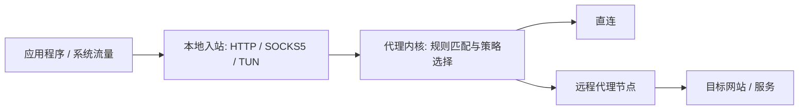
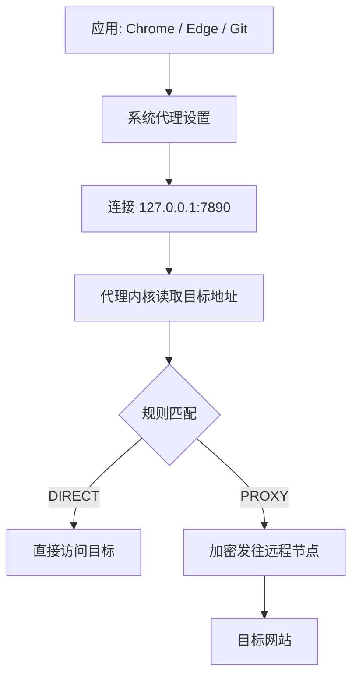

代理（Proxy）这个词看起来很简单：让一个中间人帮你访问目标地址。但真正用起来时，我们会碰到很多容易混在一起的概念：HTTP Proxy、SOCKS5、VPN、TUN、Clash、V2Ray、sing-box、订阅、规则、机场、系统代理、局域网代理、WSL 代理……这篇文章把之前散落的笔记重新整理成一条线：先建立网络分层和代理模型，再介绍协议与工具生态，最后落到常见使用场景和排障方法。

> 这篇文章只讨论网络代理的技术原理与个人网络环境配置。请遵守所在地法律法规和服务条款，不要把代理用于攻击、滥用或绕过组织安全策略。

## 1. 先从网络分层开始

理解代理之前，最好先把“流量在哪一层被接管”想清楚。不同代理工具的差别，很多时候不是“谁更神奇”，而是它们工作在不同层级。



| 层级 | 关注点 | 常见例子 | 和代理的关系 |
| --- | --- | --- | --- |
| 应用层 | 应用协议、请求格式、域名 | HTTP、HTTPS、DNS、SSH | HTTP Proxy、SOCKS5、浏览器代理通常在这里生效 |
| 传输层 | 端到端连接、端口、可靠性 | TCP、UDP、QUIC | 代理需要决定如何转发 TCP/UDP 连接 |
| 网络层 | IP 地址、路由、数据包转发 | IPv4、IPv6、ICMP | VPN、TUN 模式会在这一层接管流量 |
| 数据链路层 / 物理层 | 局域网帧、网卡、无线/有线介质 | Ethernet、Wi-Fi | 一般用户配置代理时较少直接接触 |

一个很有用的判断标准是：

- **应用层代理**：应用主动把请求发给代理。典型例子是浏览器使用 `127.0.0.1:7890` 作为 HTTP/SOCKS 代理。
- **网络层代理 / VPN / TUN**：系统路由把数据包导入虚拟网卡，应用不一定知道代理存在。典型例子是 TUN 模式、WireGuard、OpenVPN。

## 2. 一个代理系统由哪些部分组成？



把代理拆开看，一般有这些角色：

- **客户端（Client）**：运行在本机或局域网设备上，监听本地端口，接收浏览器、终端、系统代理或 TUN 网卡导入的流量。
- **入站（Inbound）**：客户端暴露给本机应用的入口，例如 HTTP 代理端口、SOCKS5 端口、透明代理端口、TUN 虚拟网卡。
- **规则（Rules）**：决定每个请求怎么走，例如直连、代理、拒绝、按国家/域名/IP 分类选择不同策略组。
- **策略组（Policy Group）**：多个节点的选择逻辑，例如手动选择、自动测速、故障切换、按地区分组。
- **出站（Outbound）**：真正发往远程代理服务器或目标网站的出口，可以是 Shadowsocks、VMess、VLESS、Trojan、Hysteria2、WireGuard，也可以是 Direct。
- **远程服务器（Server / Node）**：部署在远端，接收客户端加密后的流量，再转发到目标地址。
- **内核（Core）**：负责解析配置、处理连接、执行规则和转发流量的核心程序，例如 Clash / mihomo、V2Ray / Xray、sing-box。
- **GUI / 面板**：给用户使用的图形界面或 Web UI，例如 Clash Verge Rev、v2rayN、v2rayA、3x-ui、s-ui 等。
- **订阅（Subscription）**：用一个 URL 下发节点、规则和策略组配置，方便在多个客户端同步更新。

可以用这条链路来记：



## 3. 核心名词解释

### 3.1 HTTP Proxy

HTTP Proxy 是面向 HTTP/HTTPS 流量的应用层代理。对于普通 HTTP 请求，客户端会把“完整 URL”放在请求行里发给代理：

```http
GET http://example.com/path/page.html HTTP/1.1
Host: example.com
```

这和直连请求不同。直连时，请求已经发往 `example.com`，所以请求行只需要相对路径：

```http
GET /path/page.html HTTP/1.1
Host: example.com
```

对于 HTTPS，HTTP 代理通常使用 `CONNECT` 建立隧道：

```http
CONNECT example.com:443 HTTP/1.1
Host: example.com:443
```

代理服务器只负责建立 TCP 隧道，里面的 TLS 内容仍然由浏览器和目标站点端到端协商。

### 3.2 SOCKS5

SOCKS5 是更通用的应用层代理协议。它不关心上层是不是 HTTP，因此可以代理 SSH、Git、数据库客户端、游戏、部分 UDP 流量等。很多代理客户端会同时开放：

- HTTP 代理端口：常见如 `127.0.0.1:7890`
- SOCKS5 代理端口：常见如 `127.0.0.1:7891`
- Mixed 端口：同一个端口同时识别 HTTP 和 SOCKS5

### 3.3 VPN 与 TUN

VPN 通常在网络层或链路层建立隧道，把系统流量导入虚拟网卡，再由 VPN 程序发往远端网关。TUN 模式也是类似思路：代理客户端创建一个虚拟网卡，并修改路由表，让符合条件的数据包先进入代理内核。

应用层代理和 TUN 的差别可以这样理解：

| 模式 | 类比 | 应用是否知道代理存在 | 接管范围 | 常见用途 |
| --- | --- | --- | --- | --- |
| HTTP / SOCKS5 代理 | 应用主动去“代理窗口”办事 | 通常知道，需要配置代理地址 | 配置过代理的应用 | 浏览器、终端、开发工具 |
| TUN / VPN | 路上设置“收费站” | 通常不知道 | 系统级或路由级流量 | 全局代理、游戏、无法单独配置代理的软件 |

### 3.4 TLS、QUIC、DPI、混淆

- **TLS / SSL**：常见的传输层加密协议，HTTPS 就构建在 TLS 上。Trojan、VLESS + TLS / Reality 等方案会利用 TLS 生态来增强伪装性。
- **QUIC**：基于 UDP 的现代传输协议，支持低延迟、多路复用和连接迁移。Hysteria2 等工具常利用 UDP/QUIC 思路提升弱网表现。
- **DPI（Deep Packet Inspection）**：深度包检测，通过数据包特征识别协议、应用或异常流量。
- **混淆 / 伪装**：让代理流量看起来像普通 HTTPS、随机流量或其他协议，以降低被简单特征识别的概率。

## 4. 常见协议怎么选？

下面是常见协议的定位，而不是绝对优劣排名。真实体验还取决于网络线路、服务端配置、客户端实现、DNS 策略、拥塞和丢包情况。

| 协议 / 方案 | 大致定位 | 优点 | 注意点 |
| --- | --- | --- | --- |
| Shadowsocks (SS) | 轻量加密代理 | 简单、成熟、资源占用低 | 伪装能力有限，依赖插件可增强 |
| ShadowsocksR (SSR) | SS 的历史衍生方案 | 曾经流行，带混淆和协议插件 | 生态相对老旧 |
| VMess | V2Ray 早期主力协议 | 配置灵活，曾经很常见 | 新部署通常更多考虑 VLESS / Reality 等 |
| VLESS | V2Ray / Xray 生态的轻量协议 | 通常与 TLS、XTLS、Reality 搭配 | 本身不负责加密，需要依赖传输层组合 |
| Trojan | 模拟 HTTPS 服务形态 | 概念直观，TLS 伪装好理解 | 证书、域名、服务端配置要正确 |
| Reality | Xray 生态常见方案 | 抗主动探测能力较强 | 配置项较多，客户端兼容性要确认 |
| Hysteria2 | UDP / QUIC 思路的高速协议 | 弱网、跨境高丢包环境可能表现好 | UDP 被限速或屏蔽时体验会变差 |
| WireGuard | 现代 VPN | 简洁、高性能、跨平台 | 更像 VPN，分流和伪装需额外设计 |
| OpenVPN / IKEv2 | 传统 VPN | 成熟、企业和个人场景广 | 配置和性能取决于实现与网络环境 |
| HTTP Proxy | Web 流量代理 | 易调试，系统支持广泛 | 主要面向 HTTP/HTTPS |
| SOCKS5 | 通用程序代理 | 支持多种 TCP/UDP 应用 | 应用需要显式支持或通过工具转接 |

## 5. Clash / mihomo 生态

Clash 之所以影响很大，不只是因为它支持多种协议，更因为它把“节点 + 规则 + 策略组 + 订阅”的配置模型推广成了事实上的通用格式。很多客户端虽然内核不同，也会支持或转换 Clash 风格配置。

### 5.1 Clash 配置长什么样？

一个极简的 Clash 风格配置大概长这样：

```yaml
mixed-port: 7890
allow-lan: false
mode: rule

proxies:
  - name: "MySS"
    type: ss
    server: example.com
    port: 8388
    cipher: aes-128-gcm
    password: "mypassword"

  - name: "MyVmess"
    type: vmess
    server: vmess.example.com
    port: 443
    uuid: "xxxx-xxxx-xxxx-xxxx"
    alterId: 0
    network: ws

proxy-groups:
  - name: "Proxy"
    type: select
    proxies:
      - "MySS"
      - "MyVmess"
      - DIRECT

rules:
  - DOMAIN-SUFFIX,example.com,Proxy
  - GEOIP,CN,DIRECT
  - MATCH,Proxy
```

这里的重点不是记住所有字段，而是理解三层结构：

1. `proxies` 定义有哪些节点；
2. `proxy-groups` 定义如何选择节点；
3. `rules` 定义什么流量进入哪个策略组。

### 5.2 Clash 相关项目脉络

| 项目 | 角色 | 说明 |
| --- | --- | --- |
|  | 原始 Clash 内核 | 早期最流行的 Clash 内核项目之一 |
|  | Clash 备份 | 原始 Clash 的备份仓库 |
|  | Clash Meta / mihomo | 对 Clash 生态的延续和扩展，支持更多现代协议与功能 |
|  | 桌面 GUI | 曾经常用的 Windows 桌面客户端 |
|  | 桌面 GUI | Clash Verge 原项目 |
|  | 桌面 GUI | Clash Verge 的延续版本之一 |

如果是在 Linux 服务器或无桌面环境上使用 Clash / mihomo，可以考虑 ShellClash、clash-for-linux、clash-for-autodl 等脚本或封装；如果是在桌面使用，优先选仍在维护、文档清晰、能更新内核的 GUI。

## 6. 常见客户端与服务端工具

### 6.1 桌面端

| 工具 | 平台 | 常见核心 / 协议 | 适合人群 |
| --- | --- | --- | --- |
| Clash Verge Rev | Windows / macOS / Linux | mihomo / Clash Meta | 想用 Clash 规则分流和现代 GUI 的用户 |
| v2rayN | Windows | V2Ray / Xray / sing-box 等 | Windows 上使用 V2Ray / Xray 生态的常见选择 |
| Nekoray / NekoBox | Windows / Linux | V2Ray / sing-box 等 | 喜欢轻量 GUI、协议覆盖较广的用户 |
| v2rayA | Linux / 路由器 / Web UI | V2Ray / Xray | 服务器、Linux 桌面或路由器上用 Web 面板管理 |
| sing-box | 多平台 | sing-box | 想直接使用新一代统一代理平台的用户 |
| Surge | macOS / iOS | 多协议与规则引擎 | 开发、调试、规则管理重度用户 |

### 6.2 移动端

| 工具 | 平台 | 特点 |
| --- | --- | --- |
| Shadowrocket | iOS | 支持多协议，配置生态丰富 |
| Quantumult X | iOS | 规则和脚本能力强，适合高级用户 |
| Stash | iOS | Clash / sing-box 风格体验，界面现代 |
| Surfboard | Android | Clash 风格客户端，配置直观 |
| v2rayNG | Android | V2Ray / Xray 生态常见客户端 |
| NekoBox for Android | Android | 支持多种协议和 sing-box 生态 |

### 6.3 服务端与面板

如果自己有 VPS，通常有三种管理方式：

1. **手写配置**：最透明，但配置成本最高。
2. **脚本安装**：适合快速部署单节点，但要理解脚本做了什么。
3. **节点管理面板**：例如 x-ui、3x-ui、s-ui 等，适合管理多个用户、协议和流量统计。

无论使用哪种方式，都建议：

- 只开放必要端口；
- 使用强密码、密钥或随机 UUID；
- 定期更新内核和系统；
- 关闭不需要的 Web 面板公网访问，至少加防火墙、反向代理鉴权或仅允许特定 IP；
- 不要把订阅链接、私钥、UUID、面板地址发到公开仓库。

## 7. 系统代理到底是怎么生效的？

以 Windows 上的浏览器为例：

1. 代理客户端启动，在本机监听 `127.0.0.1:7890`。
2. GUI 把系统代理设置为 `127.0.0.1:7890`。
3. Chrome、Edge 或使用 WinINet / WinHTTP / 系统代理设置的程序读取这个配置。
4. 应用不再直接连接目标站点，而是先连接本地代理端口。
5. 代理内核读取请求目标，根据规则决定直连或发往远程节点。



这里有一个重要细节：系统代理只是告诉应用“应该主动连接哪个代理地址”，并不会神奇地劫持所有网络包。不读系统代理设置的程序，仍然可能直连。要覆盖这类程序，通常需要：

- 在程序自己的设置里配置 HTTP / SOCKS5 代理；
- 用环境变量，例如 `http_proxy`、`https_proxy`、`all_proxy`；
- 使用 TUN / VPN / 透明代理等网络层方案。

## 8. `127.0.0.1`、`0.0.0.0` 和 Allow LAN

很多代理问题都和监听地址有关。

| 监听地址 | 含义 | 谁能访问 | 常见设置 |
| --- | --- | --- | --- |
| `127.0.0.1` | 只监听本机回环地址 | 只有本机程序 | 默认更安全 |
| `0.0.0.0` | 监听所有网卡地址 | 本机 + 局域网设备 | 通常对应 Allow LAN |
| `192.168.x.x` | 只监听某个局域网网卡 | 指定局域网内可达设备 | 更精细，但不一定所有 GUI 支持 |

如果你想让手机、平板、另一台电脑或 WSL 访问宿主机上的代理，通常需要打开 **Allow LAN / 允许局域网连接**。这会让代理从“只给本机用”变成“局域网可访问”，因此也要注意安全：

- 不要在不可信 Wi-Fi 下随便打开；
- 尽量设置访问控制或防火墙；
- 不要把管理面板暴露到公网；
- 需要时才打开，用完可以关掉。

## 9. WSL 中代理为什么经常出问题？

WSL 里常见的提示是：

```text
wsl: A localhost proxy configuration was detected, but not mirrored to WSL...
```

根源通常是：Windows 里代理监听在 `127.0.0.1`，但 WSL 里的 `127.0.0.1` 未必等于 Windows 宿主机的 `127.0.0.1`。你可以把它想成：Windows 上有一个“私人窗口”，只接待 Windows 本机应用；WSL 虽然在同一台电脑里，但在网络视角下可能更像另一个邻居。

常见解决思路：

### 9.1 方案一：打开 Allow LAN

在代理客户端中启用 Allow LAN，让代理监听 `0.0.0.0` 或宿主机局域网地址，然后在 WSL 里把代理指向宿主机 IP：

```bash
export http_proxy="http://<windows-host-ip>:7890"
export https_proxy="http://<windows-host-ip>:7890"
export all_proxy="socks5://<windows-host-ip>:7891"
```

宿主机 IP 可以从 `/etc/resolv.conf`、`ip route` 或 Windows 网络信息中找到，具体取决于 WSL 网络模式。

### 9.2 方案二：使用 TUN 模式

如果应用不方便单独配置代理，或者 WSL 网络模式导致 localhost / LAN 代理不稳定，可以尝试在 Windows 代理客户端里开启 TUN 模式，让系统级流量进入代理内核。

### 9.3 方案三：在 WSL 内单独运行代理客户端

也可以在 WSL 内运行 sing-box、mihomo、v2rayA 等客户端，然后 Linux 程序直接连接 WSL 内的 `127.0.0.1`。这种方式逻辑清晰，但需要在 WSL 内维护一份配置。

## 10. Linux / Ubuntu 上使用 v2rayA 的一个例子

v2rayA 适合在 Linux 上用 Web UI 管理 V2Ray / Xray 节点。一个简化流程如下：

1. 安装 V2Ray / Xray 核心。可以参考 `v2fly/fhs-install-v2ray` 等官方或社区安装方式。
2. 下载并安装 v2rayA 的 Debian 包，例如：

   ```bash
   wget https://github.com/v2rayA/v2rayA/releases/download/v2.2.7.3/installer_debian_x64_2.2.7.3.deb
   sudo apt install ./installer_debian_x64_2.2.7.3.deb
   ```

3. 启动服务或临时运行：

   ```bash
   sudo systemctl enable --now v2raya
   # 或者临时运行
   sudo v2raya
   ```

4. 在 Web UI 中导入节点或订阅，启动代理。
5. 在终端中设置环境变量：

   ```bash
   export http_proxy="http://127.0.0.1:20171"
   export https_proxy="http://127.0.0.1:20171"
   ```

如果只想让当前命令走代理，可以写成：

```bash
https_proxy="http://127.0.0.1:20171" curl https://example.com
```

## 11. 常见排障清单

### 11.1 先确认本地端口是否在监听

```bash
# Linux / WSL
ss -lntp | rg '7890|7891|20171'

# macOS
lsof -iTCP -sTCP:LISTEN | rg '7890|7891|20171'
```

Windows 可以用 PowerShell：

```powershell
netstat -ano | findstr "7890 7891 20171"
```

### 11.2 再确认应用是否真的用了代理

```bash
curl -I https://example.com
curl -I -x http://127.0.0.1:7890 https://example.com
curl -I --socks5 127.0.0.1:7891 https://example.com
```

如果第二、三条成功而第一条失败，说明代理本身可能是好的，只是应用或系统没有正确使用代理。

### 11.3 检查 DNS

代理问题经常其实是 DNS 问题。需要确认：

- 域名是在本地解析，还是交给代理远端解析？
- 是否出现 DNS 污染、IPv6 优先、Fake-IP 缓存、规则集误判？
- Clash / mihomo 的 DNS 模式是 `redir-host` 还是 `fake-ip`？
- 浏览器是否启用了 DoH，绕过了系统 DNS？

### 11.4 检查规则命中

如果某个网站打不开，不要只看“节点是否可用”，还要看它命中了哪条规则：

- 是否被错误地 `DIRECT`？
- 是否命中了 `REJECT`？
- 是否被分到一个不可用的策略组？
- 是否 IPv6 直连失败，但 IPv4 可以？

### 11.5 检查服务端

服务端常见问题包括：

- 端口没开或防火墙拦截；
- 证书过期或域名解析错误；
- UUID / 密码 / Reality 参数不一致；
- 时间不同步导致 TLS 或协议握手失败；
- VPS 流量耗尽、线路拥堵或被限速。

## 12. 实用建议

1. **先分清“代理没启动”还是“应用没用代理”**：用 `curl -x` 直接指定代理是最快的分界线。
2. **优先用规则模式，不要长期全局代理**：规则模式能减少延迟、节省流量，也更容易定位问题。
3. **订阅链接当作密码保管**：订阅里可能包含全部节点凭据。
4. **GUI 只是外壳，内核和配置才是关键**：遇到问题时，要看内核日志、规则命中和实际监听端口。
5. **TUN 能解决很多“应用不支持代理”的问题，但也更复杂**：TUN 会影响路由、DNS、权限和防火墙，排障时要单独考虑。
6. **不要盲目追新协议**：稳定的线路、正确的 DNS、合理的规则，往往比协议名更重要。

## 13. 参考资料

- [MetaCubeX Wiki：客户端列表](https://wiki.metacubex.one/startup/client/client/)
- [Clash Wiki](https://clash.wiki/)
- [V2Fly fhs-install-v2ray](https://github.com/v2fly/fhs-install-v2ray)
- [v2rayA](https://github.com/v2rayA/v2rayA)
- [v2rayN system proxy routing 说明](https://github.com/2dust/v2rayN/wiki/Description-of-system-proxy-routing)
- [OSI 模型和 TCP/IP 模型对比](https://arch-long.cn/articles/network/OSI%E6%A8%A1%E5%9E%8BTCPIP%E5%8D%8F%E8%AE%AE%E6%A0%88.html)
